# Visto 用户手册

这份手册帮助你把一次媒体协作完整做完：建立项目、上传素材、组织审阅、收集反馈、提交新版、确认交付，再保留可恢复的归档。

更新：2026-10-03。适用范围：Visto Server 的当前主线界面；macOS 操作命令适用于 Apple Silicon 原生 Server；Windows 与 Linux 专章分别说明 Windows x64 与 Linux amd64 / ARM64 安装维护。截图来自独立演示工作空间，均为虚构项目。示意图会单独标明；界面语言和按钮位置可能随版本调整。

**阅读方式：** 已有账号的成员可以直接看“上传素材”和“审阅”；安装维护者从“安装准备”开始。网页入口为 [Visto 文档中心](web/index.html)，单文件离线版为 [完整手册](web/Visto-用户手册.html)。

<!-- chapter: start | 开始使用 -->
## 01 · 先理解 Visto

Visto 在你控制的电脑或服务器上运行，用浏览器进入工作空间。它把项目、媒体文件、不同版本、审阅反馈和分享记录放在同一条协作流程里。存储可以位于部署主机，也可以由 Owner 连接 WebDAV 或 S3 兼容服务。

“本地优先”意味着你决定数据部署在哪里。选择远程存储、配置外部通知或开放远程访问后，相关数据仍会经过你启用的服务和网络。

### 五个最常用的概念

| 概念 | 用来做什么 | 例子 |
| --- | --- | --- |
| 工作空间 | 容纳账号、项目、全局设置和基础设施 | 一个制作团队 |
| 项目 | 划定协作范围、成员和文件保存位置 | 品牌短片 · 10 月交付 |
| 媒体 / 资产 | 一份持续修订的作品或素材 | 品牌短片主片 |
| 版本 | 保留同一资产的每次上传结果 | V1 初剪、V2 调色、V3 确认版 |
| 审阅 | 围绕选定版本发起的一轮反馈与结论 | 第一轮导演审阅 |

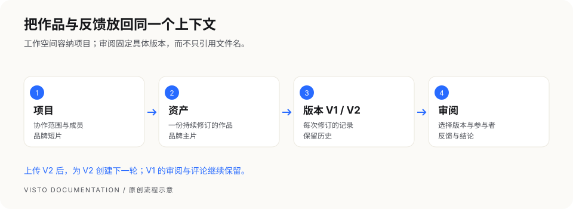

**图解：** 一个项目可以有多个资产；一个资产可以有多个版本；审阅引用选定的版本。上传新版以后，旧审阅仍保留原来审阅的版本，下一轮应明确选择新版。

### 按身份选择阅读路线

| 你的身份 | 先读哪些章节 | 你最需要知道的事 |
| --- | --- | --- |
| 安装维护者 | 安装准备 → 对应平台安装 → 媒体运行时 → 备份恢复 | 主机操作在部署机器执行，需要相应系统权限 |
| Owner | 首次设置 → 存储 → 成员权限 → 网络安全 | 管理全局基础设施，不要把 Owner 密码当团队共享密码 |
| 项目主管 | 创建项目 → 成员权限 → 审阅 → 归档 | 项目成员关系和具体权限决定协作边界 |
| 项目成员 | 上传素材 → 版本 → 审阅 → 通知 | 先进入正确项目，再上传和创建审阅 |
| 外部审阅者 | 外部审阅指南 | 使用分享链接和访问码，按开放权限查看、评论或下载 |

### 适用与限制

本手册适用于 Visto Server **1.0.3**。从[正式发布页](https://github.com/huangdiyou/Visto/releases/tag/v1.0.3)下载对应平台安装包、同名 SHA-256 与完整交付材料，核对完整摘要后再安装。视频组件另按对应平台步骤取得；Windows 包已经包含视频组件。正式版本发布不等于 stable 更新提示已切换。

macOS 系统服务正常卸载与数据保留已补验；历史首装、媒体和重启结果按变更复用。Linux ARM64 的 Rocky 8 兼容补验使用模拟客体；Docker x64 宿主整机重启未验；其他结果和已知限制见发布说明。不要将选定客体的通过扩大成所有硬件或发行版都通过。

| 交付 | 固定下载 | 摘要文件 |
| --- | --- | --- |
| Mac M 系列 | [macOS ARM64 安装包](https://github.com/huangdiyou/Visto/releases/download/v1.0.3/Visto-Server_1.0.3_macos-arm64.tar.gz) | [SHA-256](https://github.com/huangdiyou/Visto/releases/download/v1.0.3/Visto-Server_1.0.3_macos-arm64.tar.gz.sha256) |
| Windows x64 | [Windows ZIP](https://github.com/huangdiyou/Visto/releases/download/v1.0.3/Visto-Server_1.0.3_windows-x64.zip) | [SHA-256](https://github.com/huangdiyou/Visto/releases/download/v1.0.3/Visto-Server_1.0.3_windows-x64.zip.sha256) |
| Linux x86_64 | [Linux amd64 安装包](https://github.com/huangdiyou/Visto/releases/download/v1.0.3/Visto-Server_1.0.3_linux-amd64.tar.gz) | [SHA-256](https://github.com/huangdiyou/Visto/releases/download/v1.0.3/Visto-Server_1.0.3_linux-amd64.tar.gz.sha256) |
| Linux ARM64 | [Linux arm64 安装包](https://github.com/huangdiyou/Visto/releases/download/v1.0.3/Visto-Server_1.0.3_linux-arm64.tar.gz) | [SHA-256](https://github.com/huangdiyou/Visto/releases/download/v1.0.3/Visto-Server_1.0.3_linux-arm64.tar.gz.sha256) |
| 手册、公钥、源码及 Docker 构建材料 | [完整公开交付 ZIP](https://github.com/huangdiyou/Visto/releases/download/v1.0.3/Visto-Public-Delivery_1.0.3.zip) | [SHA-256](https://github.com/huangdiyou/Visto/releases/download/v1.0.3/Visto-Public-Delivery_1.0.3.zip.sha256) |

升级维护脚本需要的 [1.0.3 版本清单](https://github.com/huangdiyou/Visto/releases/download/v1.0.3/Visto-Server_1.0.3.manifest.json)只用于明确选择这个此版本的维护者，不改变在线 stable 指针。

完整公开交付解压后包含 `docs/USER_GUIDE.md`、网页及离线手册、`keys/media-runtime-root-public-key.txt`、`Dockerfile`、`compose.yaml`、配套配置和维护工具。Docker 可以按第 09 章从完整源码构建两种架构；此入口不承诺已有公开预构建镜像。部署和首次构建仍需下载固定依赖及对应的视频组件，无需访问内部仓库。


<!-- chapter: quick-start | 开始使用 -->
## 02 · 做完你的第一个项目

本章面向已经能打开 Visto 的 Owner 或项目主管。建议先用一张不含敏感内容的图片完成练习，再接入真实项目。

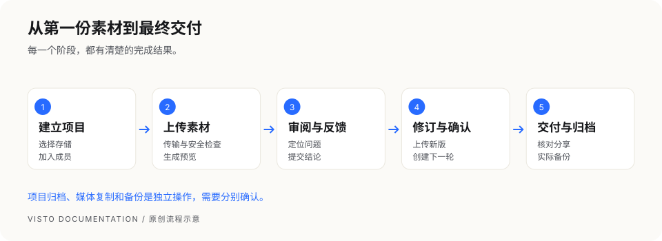

### 第一步：确认保存位置

Owner 进入 **Owner 设置 → 存储与上传安全**，至少创建一个可供项目上传使用的存储位置，并开放给需要的项目。项目主管看不到存储或没有创建权限时，请联系 Owner。

### 第二步：创建项目

在项目列表点“新建项目”，填写名称、项目说明，并选择项目存储位置。建议名称包含作品与交付批次，如“品牌短片 · 10 月交付”；说明写清目标、负责人和交付日期。

### 第三步：上传一份媒体

进入新项目的“媒体”，选择“上传本地文件”。等上传完成，再等媒体状态变成可预览。上传完成只说明传输结束，后台预览处理可能还在继续。

### 第四步：创建第一轮审阅

打开素材详情，确认是 V1，点“创建审阅”。填写审阅名称，选择参与成员、通过条件和截止时间；需要外部反馈时，设置访问密码、评论和下载权限，再创建审阅分享。

### 第五步：收集并处理反馈

用分享入口查看图片或播放视频。提交一条能定位到画面或时间的反馈，项目内核对评论，再回复处理结果。需要正式结论时由具备权限的审阅者提交“通过”“需修改”或“拒绝”。

### 第六步：提交新版

回到原资产的详情，选择“上传新版本”，上传修订文件。确认 V2 出现在版本历史里，以 V2 创建下一轮审阅。不要为了升级版本而把同一作品反复作为独立资产上传。

### 第七步：交付与归档

确认最新版本通过、交付链接权限正确、接收者能访问后，再归档项目。归档保留项目记录并暂停项目内写入；备份还需要由部署维护者单独执行。

### 完成检查

- 项目名称、保存位置和参与成员正确。
- 图片或视频能正常预览；没有未处理的隔离或失败提示。
- 反馈能回到原版本和具体位置。
- V1、V2 的历史都保留，当前版本明确。
- 分享在接收者设备上能打开；下载权限符合交付要求。
- 重要数据已有实际备份，项目归档不能替代备份。

<!-- chapter: navigation | 开始使用 -->
## 03 · 熟悉工作台

工作台围绕项目组织日常任务。进入项目后，首先确认顶部项目名，避免把文件或反馈提交到另一个项目。

### 全局入口与项目入口

| 入口 | 用途 | 谁能使用 |
| --- | --- | --- |
| 项目 | 查看自己可见的项目、切换项目 | 已登录用户，结果由权限决定 |
| Owner 设置 | 账号、网络、存储、通知、系统活动与诊断 | Owner |
| 通知 | 查阅站内通知和相关活动 | 按用户及项目权限 |
| 我的账户 | 个人资料、语言、接收偏好与退出 | 当前用户 |
| 项目概览 | 汇总审阅、未解决反馈、最近版本和失败任务 | 项目可见成员 |
| 项目媒体 | 上传、搜索、预览、版本与回收站 | 按项目权限 |
| 项目审阅 | 创建审阅、看板、详情、结论及分享 | 按项目权限 |
| 项目设置 | 基本资料、成员、存储、活动和生命周期 | 按具体管理权限 |

### 用项目概览判断下一步

“项目脉搏”把当前最值得处理的任务汇总出来。先看失败任务是否影响预览，再看未解决反馈和待处理审阅，最后确认最近版本。计数可能受权限和数据加载影响；读取失败时重新加载，不把空白当作“全部处理完”。

### 页面保存的判断方法

点击保存、上传、复制或测试后，要看页面的完成提示。按钮显示“处理中”表示还没结束；错误信息应在当前操作区域处理。复制失败时，查看可见文本再手动复制，不连续点按钮造成重复审阅或分享。

<!-- chapter: prepare | 安装与初始化 -->
## 04 · 安装前的准备

如果你只是受邀参与项目，无需安装 Server，使用团队给你的工作空间地址即可。只有负责部署的人员需要本章。

### 选择部署方式

| 方式 | 适合谁 | 浏览器入口 | 需要注意 |
| --- | --- | --- | --- |
| macOS Apple Silicon 原生 Server | 使用 M 系列 Mac 的安装维护者 | 默认 `http://127.0.0.1:8787/` | 安装需要系统管理员权限；FFmpeg 运行时独立安装 |
| Docker Compose | 已经熟悉容器和持久数据卷的维护者 | 默认 `http://127.0.0.1:8080/` | 以本次发布支持范围为准；保留数据卷和配置 |
| Windows x64 原生 Server | Windows 主机维护者 | 默认 `http://127.0.0.1:8787/` | 见“Windows x64 安装与维护”，使用开机计划任务 |
| Linux amd64 / ARM64 原生 Server | systemd Linux 主机维护者 | 默认 `http://127.0.0.1:8787/` | 见“Linux amd64 / ARM64 安装与维护”，需核对架构、glibc 和媒体运行时 |

### 在开始之前准备好

1. 确认设备架构和安装包匹配。M 系列 Mac 使用 `macos-arm64` 包。
2. 从 [官方 Release 页面](https://github.com/huangdiyou/Visto/releases) 获取同一版本的安装包、SHA-256 和发布说明。页面未开放或没有正式包时，不要换用不明镜像。
3. 准备系统管理员密码、一个强 Owner 密码，以及足够存放原片、预览和备份的磁盘空间。
4. 为素材安排独立目录。不要把整个用户主目录或系统目录当作媒体上传位置。
5. 首次设置在部署主机完成；首次初始化令牌只给这台主机的维护者使用。
6. 已有实例升级时，先读“更新、恢复与回滚”，不要按全新安装覆盖现有数据。

### 本机地址是什么意思

`127.0.0.1` 指向**当前打开浏览器的设备**。在你的 Mac 上，它指向这台 Mac；在同事电脑上，它指向同事电脑。因此同事无法使用你的 `127.0.0.1` 分享地址访问部署在你 Mac 上的服务。

跨设备协作需要一个接收者能访问到的团队地址，并配置对应网络入口。参见“网络与远程访问”。

<!-- chapter: install-macos | 安装与初始化 -->
## 05 · Apple Silicon macOS 安装

本章适用于已经取得对应 macOS ARM64 安装包的维护者。命令中的 `<版本>` 是占位符，必须替换成你下载的版本；尖括号也要去掉。所有操作都在部署 Visto 的 Mac 上完成。

### 1. 下载并核对 SHA-256

保存 `Visto-Server_<版本>_macos-arm64.tar.gz` 与同一次交付的 `.sha256` 文件。打开终端，进入下载目录后执行：

```bash
cd "$HOME/Downloads"
shasum -a 256 'Visto-Server_<版本>_macos-arm64.tar.gz'
```

把输出的 64 位摘要与官方发布页或 `.sha256` 内容逐字对照。不同则停止，不要安装。摘要相同证明下载内容一致，仍需要确认下载来源。

### 2. 解压到独立目录

新版本使用一个新目录，避免把旧包的脚本与新包混在一起：

```bash
mkdir -p "$HOME/Downloads/visto-server-<版本>"
tar -xzf "$HOME/Downloads/Visto-Server_<版本>_macos-arm64.tar.gz" \
  -C "$HOME/Downloads/visto-server-<版本>"
cd "$HOME/Downloads/visto-server-<版本>"
```

确认当前目录里有 `scripts/install-visto-server.sh`，再执行安装：

```bash
sudo bash scripts/install-visto-server.sh \
  --version '<版本>' \
  --source-dir "$PWD"
```

终端输入系统管理员密码时不会显示字符，这是系统的正常行为。

### 3. 处理 macOS 首次运行提示

当前交付方案没有 Apple Developer ID 签名和公证。macOS 可能分别拦截 `visto-core` 和 `visto-server`。核对来源和摘要之后，在“系统设置 → 隐私与安全性”找到被阻止的程序，按系统提示“仍要打开”。如果第二个程序随后被拦截，对它单独操作。

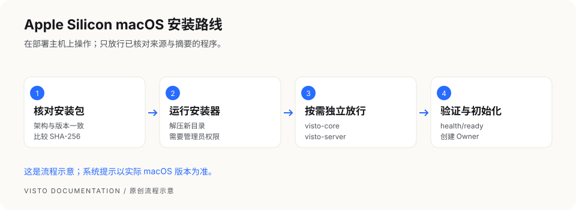

**这是流程示意，不是 macOS 截图。** 手动放行不代表 Apple 已验证开发者。不要全局关闭 Gatekeeper。安装器如果报服务未就绪，先处理拦截再检查服务，不要把退出失败当成安装成功。

```bash
sudo launchctl kickstart -k system/com.visto.server
curl -fsS http://127.0.0.1:8787/health/ready
```

看到 `"status":"ready"` 后，打开 `http://127.0.0.1:8787/`。如果使用了自定义端口，命令和浏览器地址都替换成对应端口。

### 4. 确认安装后的目录

| 内容 | 默认位置 | 日常用途 |
| --- | --- | --- |
| 程序与保留版本 | `/Library/Visto` | 使用 `current` 中的正式工具，不手工改链接 |
| 主机配置 | `/Library/Visto/config/visto.env` | 部署维护者修改，修改后按要求重启 |
| 业务数据 | `/Library/Application Support/Visto/data` | 包含数据库和系统托管数据，不能直接删除 |
| 默认备份 | `/Library/Application Support/Visto/backups` | 保存归档及其元数据，另做异盘副本 |
| 日志 | `/Library/Logs/Visto` | 故障定位，分享前脱敏 |

**完成检查：** 服务就绪、浏览器能打开向导、未忽略安装失败信息。视频预览还需要下一章的媒体运行时。

<!-- chapter: windows-install | 安装与初始化 -->
## 06 · Windows x64 安装与维护

本章面向在 Windows 主机上部署 **Server** 的维护者。项目成员只需要浏览器，不必安装 Desktop、Node.js 或 Go。以下步骤按当前 Windows 安装及维护脚本编写；正式支持的 Windows 版本、最终包和实机验收以对应 Release 说明为准。安装前确认包与本版本匹配。

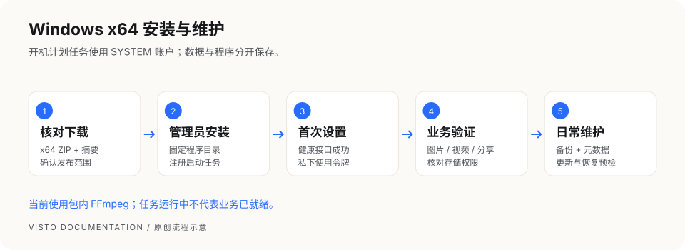

### 1. 准备机器与安装材料

- 使用 x64 Windows；本章不适用于 Windows ARM64，也不适用于 Desktop 安装器。
- 准备本机管理员权限。安装器需要注册开机任务并保护程序、数据目录的访问权限。
- 准备固定本机程序目录，例如 `C:\Program Files\Visto Server`。不要在下载临时目录、网络共享目录或云同步目录中直接运行。
- 准备原片、预览和备份容量。数据目录默认为 `%ProgramData%\Visto\data`，备份应另存一块可靠磁盘。
- 从本章上方固定候选下载入口或后续官方 Release 获取同版本 ZIP、SHA-256 和说明。更新时还需要对应版本清单；不存在的下载入口不能用未知镜像替代。

Windows 的主机目录指 **Server 所在电脑** 的目录，成员电脑上的 `D:\素材` 不会自动出现在服务器上。映射网络盘也可能只属于你的登录会话，而开机任务使用 `SYSTEM` 账号；不要用资源管理器能打开网络盘来判断服务一定能读到它。

### 2. 核对文件并解压

示例版本 `1.0.3` 只是命令格式示例，请替换为你实际获得的版本。先在下载目录检查摘要：

```powershell
Get-FileHash .\Visto-Server_1.0.3_windows-x64.zip -Algorithm SHA256
```

把完整的 64 位结果与可信发布页或同名 `.sha256` 对照；不一致时停止安装，重新下载。SHA-256 验证完整性，下载来源仍须核对。

在管理员 PowerShell 中解压到一个尚未使用的固定目录：

```powershell
Expand-Archive -LiteralPath "$env:USERPROFILE\Downloads\Visto-Server_1.0.3_windows-x64.zip" `
  -DestinationPath 'C:\Program Files\Visto Server'
Set-Location 'C:\Program Files\Visto Server'
Get-ChildItem
```

目录应包含 `bin`、`web`、`visto-server.json`、`VistoServer.Security.psm1` 和安装/启动/备份/恢复/更新/卸载脚本。当前启动脚本还要求 `runtime\ffmpeg\ffmpeg.exe` 与 `ffprobe.exe`；缺失时不能从网上随便补二进制。已有安装不能用解压覆盖来升级。

### 3. 安装开机任务

在管理员 PowerShell 的程序目录执行：

```powershell
Set-ExecutionPolicy -Scope Process Bypass -Force
.\Install-VistoServer.ps1
```

该执行策略只对当前 PowerShell 进程有效。若组织策略禁止运行脚本，交给系统管理员处理，不调整整机策略来绕过组织限制。

安装器注册名为 `Visto Server` 的计划任务，使用 `SYSTEM` 账号在开机时运行，异常退出时尝试重启。程序、数据与备份目录会限制普通用户写入；不要安装后再给“所有人”开放写权限，也不要将这些目录替换成目录联接或符号链接。

### 4. 确认就绪并完成首次设置

```powershell
Get-ScheduledTask -TaskName 'Visto Server'
Get-ScheduledTaskInfo -TaskName 'Visto Server'
Invoke-WebRequest -Uri 'http://127.0.0.1:8787/health/ready' -UseBasicParsing
.\bin\visto-server.exe --address 127.0.0.1:8787 status
```

计划任务存在、显示运行中只是进程层证据；健康接口返回成功、浏览器能打开页面才继续首次设置。默认入口为 `http://127.0.0.1:8787/`。若改过 `visto-server.json` 的 `address`，用实际端口检查。

初始化令牌在 `%ProgramData%\Visto\data\host-management-token.txt`，安装器只显示位置和短指纹。需要时由本机管理员私下读取并填入首次设置页；不要截图、发给成员或打包进求助材料。随后按“首次设置与登录”建立工作空间、Owner 账户及一次性的目录权限选择。

### 5. 程序、配置、数据分别在哪里

| 内容 | 默认位置或入口 | 用途 |
| --- | --- | --- |
| 程序与网页 | `C:\Program Files\Visto Server`（示例） | 固定程序目录，更新由脚本替换 |
| 配置 | 程序目录下 `visto-server.json` | 监听地址、数据目录及部署选项 |
| 实例数据 | `%ProgramData%\Visto\data` | 数据库、秘密、数据目录内上传及预览 |
| 默认备份 | `%ProgramData%\Visto\backups` | 数据归档和同名元数据 |
| 启停 | 计划任务 `Visto Server` | 默认开机自启、使用 SYSTEM |
| 当前视频依赖 | 程序目录 `runtime\ffmpeg` | 当前包内运行时；以后以包说明为准 |

修改配置前保留受保护的原配置副本，修改后重启任务。配置与令牌包含敏感信息，不作为公开求助附件。

### 6. 日常启动、停止和诊断

```powershell
Stop-ScheduledTask -TaskName 'Visto Server'
Start-ScheduledTask -TaskName 'Visto Server'
.\bin\visto-server.exe --data-dir "$env:ProgramData\Visto\data" doctor
.\bin\visto-server.exe --data-dir "$env:ProgramData\Visto\data" diagnostics export `
  --output "$env:USERPROFILE\Desktop\visto-diagnostics.zip"
```

停止命令发出后需确认任务和相关进程确实停止。备份、恢复和更新脚本会进行自己的停服确认，不要删掉检查来强制执行。如果文件锁导致备份失败，任务可能保持停止；解除占用后先检查备份结果，再显式启动任务并验证健康和媒体，不假定自动恢复。诊断包先自行检查敏感内容，再按受控方式交给维护者。

### 7. 备份与恢复

先通知成员暂停写入，再运行：

```powershell
.\Backup-VistoServer.ps1 -BackupDirectory 'D:\Visto-backups'
```

成功结果必须同时有 ZIP 与同名 `.zip.json` 元数据，保留二者并复制到独立位置。该备份覆盖实例数据目录；配置在程序目录、外部本机媒体目录、WebDAV 和 S3 原片需另行保护。不能把一个 ZIP 当成全部项目原片的备份。

恢复分为两步。以下文件名为示例，替换为真实备份：

```powershell
.\Restore-VistoServer.ps1 -BackupFile 'D:\Visto-backups\visto-server-data-20260930-120000.zip' -CheckOnly
.\Restore-VistoServer.ps1 -BackupFile 'D:\Visto-backups\visto-server-data-20260930-120000.zip' -ConfirmRestore
```

只读检查通过后，先确认当前数据也有独立备份，再执行替换。不要同时传 `-CheckOnly` 与 `-ConfirmRestore`。摘要、归档路径或来源数据目录不符时停止；不编辑元数据骗过检查，也不用恢复命令做跨目录迁移。恢复后检查项目、旧媒体、新上传与分享。

### 8. 更新与失败恢复

下载同一版本 ZIP、发布摘要和版本清单，保留程序目录配置并准备更新前备份。将路径和摘要替换为真实值：

```powershell
.\Update-VistoServer.ps1 `
  -PackageArchive 'D:\Downloads\Visto-Server_1.0.3_windows-x64.zip' `
  -ExpectedSha256 '<发布页公布的64位SHA-256>' `
  -ManifestFile 'D:\Downloads\该版本的清单.json' `
  -BackupDirectory 'D:\Visto-backups'
```

不传 `-ManifestFile` 时脚本寻找 `<安装包完整路径>.manifest.json`；只有 ZIP 和摘要并不足够。清单必须与包版本匹配，发布者没提供时联系维护者，不自行拼写。

更新只接受完整交付 ZIP，包括固定视频二进制、许可证、构建记录和视频审计材料；不要裁剪文件或向运行时目录随意添加 DLL。

脚本校验并暂存输入，备份数据、停止任务、替换程序并等待恢复。失败时会尝试还原旧程序及更新前数据。即使脚本报告成功，也要核对健康接口与实际业务；端口能连不代表媒体和数据库已正常。当前 Windows 脚本没有独立的 `Rollback-VistoServer.ps1`，不要照搬 Unix 回滚命令。自动恢复失败时保留原程序、备份与错误输出，交给维护者处理。

### 9. 常见问题按现象处理

| 现象 | 先检查 | 下一步 |
| --- | --- | --- |
| 提示需要管理员权限 | PowerShell 是否“以管理员身份运行” | 重新打开管理员窗口，进入程序目录 |
| 脚本被系统拦截 | 文件来源、摘要与组织策略 | 按安全软件/管理员提示处理，不全局关闭保护 |
| 缺少 FFmpeg、网页或安全模块 | 是否解压完整、是否拿错包 | 重取同版本完整包，保留错误信息 |
| 任务存在但页面打不开 | 任务结果、健康接口、配置端口 | 执行 doctor；不要把任务存在当成功 |
| 端口被占用 | `Get-NetTCPConnection -LocalPort 8787 -ErrorAction SilentlyContinue` | 安装会先拒绝占用，尚不创建新数据或任务；找到占用程序后决定是否改配置，不盲目结束进程 |
| 服务读不到映射盘 | SYSTEM 与登录用户的访问差异 | 用受维护存储连接或明确服务可访问的存储方案 |
| 更新提示文件锁或停服失败 | 是否还有服务/媒体进程 | 保留现场，解决占用后再试，不手工覆盖 |
| ACL 或重解析点检查失败 | 目录权限、联接/符号链接 | 修复受信目录布局，不删保护检查 |

### 10. 卸载与交付检查

```powershell
.\Uninstall-VistoServer.ps1
```

默认停止并删除开机任务，保留实例数据；不等于程序目录和外部原片已删除。只有独立备份可读、确定永久清除实例数据后，才使用 `-RemoveData`。不要将清除命令当成排障方法。

交付前逐项确认：重启电脑后服务就绪；Owner 可登录；成员仅看授权项目；旧媒体能打开；新上传能生成预览；HTTPS 分享可访问；备份 ZIP 与元数据已独立保存。当前候选已在干净 Windows 11 客体执行安装、浏览器播放、更新回退、恢复、整机重启及卸载保留检查。文件锁失败仍须按上面的人工处置步骤处理；有 NVIDIA 显卡不代表此组件支持 NVENC。

<!-- chapter: linux-install | 安装与初始化 -->
## 07 · Linux amd64 / ARM64 安装与维护

本章面向使用 **systemd 的 glibc Linux 主机** 的维护者，按当前 Linux 打包与 Unix 运维脚本编写。amd64 与 ARM64 共用步骤，安装包不能混用。正式包、发行版支持和媒体运行时供应以对应 Release 为准；源码里存在安装脚本不代表最终 Linux 包已通过实机验收。

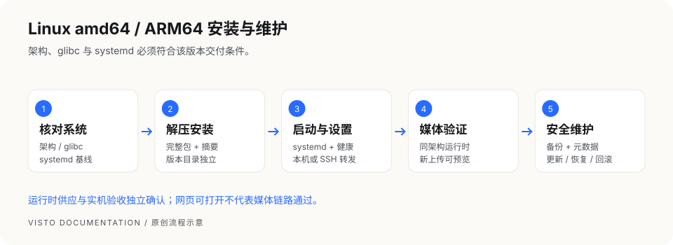

### 1. 核对系统和架构

```bash
uname -m
getconf GNU_LIBC_VERSION
systemctl --version
```

| 检查项 | 当前交付契约基线 | 如何选择 |
| --- | --- | --- |
| `uname -m` 为 `x86_64` | Linux amd64 | 使用 `linux-amd64.tar.gz` |
| `uname -m` 为 `aarch64` | Linux ARM64 | 使用 `linux-arm64.tar.gz` |
| C 库 | glibc ≥ 2.28 | musl / Alpine 不在本原生说明范围 |
| 服务管理器 | systemd ≥ 239 | 无 systemd 的 NAS、容器或 WSL 不照搬本章 |
| 内核 | ≥ 4.18 | 最终发行版支持以 Release 为准 |

上述为项目当前契约要求，不代表每个满足版本号的发行版均已验收。准备 `sudo` 权限、Bash、GNU tar、常用系统工具，以及 `curl` 和 SHA-256 工具。不要为安装程序替换系统 C 库；不符合基线时使用受支持主机，或按 Docker 章节和发布支持范围选择容器部署。

### 2. 下载并核对摘要

获取同版本的安装包、SHA-256 和说明。下列 `1.0.3` 为格式示例，替换为实际版本；ARM64 把包名中的 `amd64` 改为 `arm64`。

```bash
sha256sum Visto-Server_1.0.3_linux-amd64.tar.gz
```

逐字对照可信发布页的 64 位摘要。不要从另一个包、架构或版本复制摘要。来源或摘要不明时停止。更新时还要准备同版本清单。

### 3. 解压并安装

在独立、尚未使用的本机目录解压；下面命令不在现有程序目录上覆盖文件：

```bash
mkdir -p "$HOME/visto-install-1.0.3"
tar -tzf Visto-Server_1.0.3_linux-amd64.tar.gz
tar -xzf Visto-Server_1.0.3_linux-amd64.tar.gz -C "$HOME/visto-install-1.0.3"
cd "$HOME/visto-install-1.0.3"
ls bin web scripts
sudo bash scripts/install-visto-server.sh \
  --version 1.0.3 \
  --source-dir "$PWD"
```

解压后应有 `bin/visto-core`、`bin/visto-server`、`web/index.html`、完整维护脚本及许可声明。安装器复制程序到版本目录、生成受保护配置、注册并启动 systemd 服务。缺文件、架构错误或版本目录已存在时先排查，不加覆盖参数绕过。

默认 systemd 服务使用专用非登录账号 `visto`。组件与配置由管理员持有，服务不能写入；业务数据由服务账号持有。额外本机媒体目录需要管理员明确授予该账号所需读写权限，不能通过把服务改回 root 来解决。

首次安装默认监听 `127.0.0.1:8787`。需要不同端口时，安装命令可增加 `--address 127.0.0.1:8788`；之后所有检查与代理都用实际端口。已经部署的实例不能用再次安装同版本来做更新。

### 4. 确认服务与浏览器入口

```bash
sudo systemctl status visto.service --no-pager
curl -fsS http://127.0.0.1:8787/health/ready
sudo /opt/visto/current/bin/visto-server --address 127.0.0.1:8787 status
```

服务 `active` 后还需健康检查成功、页面可打开。服务器有浏览器时打开 `http://127.0.0.1:8787/`。如果是无桌面的远程主机，自己电脑里的 `127.0.0.1` 指向自己电脑，并不指向服务器。

有 SSH 权限的维护者可临时把远端回环端口转到本机，用于首次设置和诊断：

```bash
ssh -N -L 18787:127.0.0.1:8787 "<你的SSH用户>@<服务器地址>"
```

保持连接，在自己电脑浏览器打开 `http://127.0.0.1:18787/`。尖括号内容必须替换；此通道只供授权维护者使用，日常成员和客户使用正式 HTTPS 工作空间地址。首次设置令牌默认在 `/etc/visto/host-management-token`，由主机管理员私下读取使用，勿公开配置内容。

### 5. 安装后的目录地图

| 内容 | 默认位置 | 维护方式 |
| --- | --- | --- |
| 程序版本 | `/opt/visto/releases/<版本>` | 各版本独立保存 |
| 当前程序 | `/opt/visto/current` | 指向当前版本，不手动替换 |
| 配置 | `/etc/visto/visto.env` | 系统管理员维护，包含秘密 |
| 数据 | `/var/lib/visto` | 数据库、秘密、目录内上传与预览 |
| 备份 | `/var/backups/visto` | 归档与同名元数据 |
| 日志 | systemd 239 使用 journal；240 及以上使用 `/var/log/visto/server.log`、`server.err` | 排查启动与处理错误 |
| 服务定义 | `/etc/systemd/system/visto.service` | 安装器生成 |
| 媒体运行时根 | `/var/lib/visto-runtime` | 使用当前版本支持的运行时工具管理 |

如果安装时使用自定义数据目录或部署覆盖变量，记录真实路径，维护命令也要匹配该实例，不能假定所有主机都用默认值。外部媒体根权限与服务沙箱需要一致；系统管理员应按实际存储方案配置，不通过关闭全部服务保护来解决读写问题。

### 6. 视频预览与媒体运行时

Linux Server 的当前打包脚本生成主程序、网页和维护工具，**不在该脚本内自动打入 FFmpeg**。页面打开后仍需核对视频处理运行时。

此次交付选择 Linux `.2` 视频组件，两种架构均按 glibc 2.28 重建并检查依赖闭包。ARM64 已在 Ubuntu 24.04 原生客体及 Rocky 8.10 ARM64 模拟客体执行；x86_64 已在 Rocky Linux 8.10（glibc 2.28、systemd 239、SELinux 启用）执行原生生命周期及正式根签名安装、编码和篡改拒绝检查。具体覆盖范围以发布清单为准，不据此承诺所有 Linux 发行版。旧 Linux 组件分别需要较新的 glibc，不能拿来替代本次固定组合。本次固定 `.2` 归档、正式签名清单及对应源码已经公开可下载，并已核对摘要与正式根签名。历史使用临时 QA 签名的记录保留；此次正式信任验证另行记录，不把旧 QA 签名结果冒充正式签名通过。

以下步骤独立下载固定公钥，并核对内容；也可从本次完整公开交付取得同一公钥。无需安装 Node.js、Go 或克隆内部仓库。不能使用下载归档自带的公钥代替可信根。

```bash
(
set -eu
case "$(uname -m)" in
  aarch64) RUNTIME_VERSION=ffmpeg-8.1.2-linux-arm64-lgpl.2 ;;
  x86_64) RUNTIME_VERSION=ffmpeg-8.1.2-linux-amd64-lgpl.2 ;;
  *) echo '不支持的架构'; exit 1 ;;
esac
RUNTIME_BASE="https://visto-server-updates.pages.dev/media-runtime/$RUNTIME_VERSION"
mkdir -p "$HOME/visto-runtime-install"
curl -fL "$RUNTIME_BASE/media-runtime-manifest.json" \
  -o "$HOME/visto-runtime-install/manifest.json"
curl -fL "$RUNTIME_BASE/media-runtime-manifest.json.sig" \
  -o "$HOME/visto-runtime-install/manifest.json.sig"
curl -fL 'https://dl.819101.xyz/server/candidates/20261001/media-runtime-root-public-key.txt' \
  -o "$HOME/visto-runtime-install/public-key.txt"
test "$(cat "$HOME/visto-runtime-install/public-key.txt")" = 'lMcaxJOtCeDaiJgeW0S5Gh/m3PYQ4WG7ijIs9yxVZ2M=' || { echo '公钥不符，停止安装'; exit 1; }
sudo /opt/visto/current/bin/visto-server --json media-runtime install \
  --media-runtime managed \
  --manifest "$HOME/visto-runtime-install/manifest.json" \
  --signature "$HOME/visto-runtime-install/manifest.json.sig" \
  --public-key "$(cat "$HOME/visto-runtime-install/public-key.txt")" \
  --non-interactive --confirm-download
sudo systemctl restart visto.service
sudo /opt/visto/current/bin/visto-server --json media-runtime status
curl -fsS http://127.0.0.1:8787/health/ready
)
```

任何下载、签名、摘要或探测失败均停止；不要忽略错误继续重启。成功后确认组件状态和 `health/ready` 的 `ffmpeg`、`ffprobe` 都是 `true`。自定义实例必须让主机工具与服务使用相同 `VISTO_MEDIA_RUNTIME_ROOT`；默认实例为 `/var/lib/visto-runtime`。旧安装若配置仍指向 `/opt/visto/media-runtime` 或 `/var/lib/visto/runtime`，先按实际配置指定相同根，不能把两个目录混用。

运行时安装后重启服务，上传小型测试视频，等待处理完成、播放预览并提交时间点评论；再验证一份图片。只有这些业务步骤成功，才能确认该实例的媒体链路可用。

### 7. 启停、日志和诊断

```bash
sudo systemctl stop visto.service
sudo systemctl start visto.service
sudo systemctl restart visto.service
sudo journalctl -u visto.service -n 100 --no-pager
sudo tail -n 100 /var/log/visto/server.err
sudo /opt/visto/current/bin/visto-server --data-dir /var/lib/visto doctor
```

systemd 239 使用 `sudo journalctl -u visto.service -n 100 --no-pager` 查看日志，文件日志步骤只用于 systemd 240 及以上。

服务启动失败时先读日志，再检查配置和依赖；不要反复重装或删除数据。日志可能含路径和用户信息，提供求助材料前脱敏。服务修改配置后需重启；网页中的业务设置按页面反馈判断保存是否完成。

### 8. 备份并验证覆盖范围

```bash
sudo /opt/visto/current/scripts/backup-visto-server.sh
```

也可在独立备份磁盘上指定保存目录，须确认磁盘已挂载且容量足够：

```bash
sudo /opt/visto/current/scripts/backup-visto-server.sh --backup-dir /mnt/backup/visto
```

脚本先证明服务停止，再归档数据目录并生成数据库事实元数据，之后启动服务。只有归档和元数据均成功生成才算本次备份完成。备份放另一磁盘或可信远程位置；外部媒体、WebDAV、S3、`/etc/visto` 的部署配置另行备份。迁移到新主机还涉及恢复路径约束，不能直接承诺跨主机/跨目录恢复。

### 9. 更新、恢复与回滚

**更新**使用实际下载的包、摘要和同版本清单。示例输入需全部替换：

```bash
sudo /opt/visto/current/scripts/update-visto-server.sh \
  --package '/实际路径/Visto-Server_1.0.3_linux-amd64.tar.gz' \
  --sha256 '<发布页公布的64位SHA-256>' \
  --manifest '/实际路径/该版本的清单.json'
```

上面示例为 x86_64；ARM64 使用同版本的 `Visto-Server_1.0.3_linux-arm64.tar.gz` 和该文件对应摘要，不能混用架构。

脚本验证布局，准备新版本、备份数据、停服并切换 `current`，失败时尝试还原。没有清单时停止，不手工改 `current` 或覆盖运行中的程序。更新成功后检查旧数据与新上传，不只看进程。

**恢复**先跑只读检查；示例归档名替换为真实备份：

```bash
sudo /opt/visto/current/scripts/restore-visto-server.sh \
  --backup-file '/var/backups/visto/实际备份.tar.gz' --check-only
sudo /opt/visto/current/scripts/restore-visto-server.sh \
  --backup-file '/var/backups/visto/实际备份.tar.gz' --confirm-restore
```

恢复会替换当前实例数据，先另做当前数据备份。归档与同名元数据必须一起保留，只支持检查认可的原数据目录；旧格式元数据或路径不符被拒绝时，不手改元数据。

**回滚程序版本**先检查保留的版本：

```bash
sudo ls /opt/visto/releases
sudo /opt/visto/current/scripts/rollback-visto-server.sh \
  --to-version '<仍保留的版本号>' --confirm-rollback
```

回滚程序不等于把数据库和媒体恢复到任意历史时刻。数据兼容性与恢复需求要分别判断；目标版本已清理或数据不兼容时联系维护者。成功后重新检查健康、登录、媒体与分享。

### 10. 网络与常见问题

默认 Core 仅监听回环。日常远程访问用受维护的 HTTPS 反向代理，再在工作空间配置外部访问地址；不要直接把 8787 暴露到公网。防火墙开放的是代理入口，浏览器里的本机地址不能发给客户。

| 现象 | 先检查 | 处理方向 |
| --- | --- | --- |
| `Exec format error` | `uname -m` 与安装包架构 | 换同架构完整包 |
| glibc 版本错误 | `getconf GNU_LIBC_VERSION` | 换受支持系统，不替换系统 C 库 |
| 找不到 systemctl | 主机是否真正使用 systemd | 选择符合基线主机，或按 Docker 支持范围部署 |
| 安装缺网页/脚本/声明 | 解压根目录与包完整性 | 用完整包，不分别下载文件拼装 |
| 服务启动失败 | `journalctl`、`server.err` | 查地址占用、配置、目录权限与运行依赖 |
| 端口被占用 | `sudo ss -ltnp 'sport = :8787'` | 查明占用者，选择其它端口，不盲目杀进程 |
| 上传不能写或空间不足 | 实际存储权限、挂载和 `df -h` | 修复真实存储条件，保留已有数据 |
| 视频无预览 | 同架构运行时、处理任务状态 | 核对运行时供应和安装结果 |
| SSH 转发打不开 | SSH 连接、远端健康、本机端口 | 分别确认两端，不改为公网裸端口 |
| 停服检查/恢复预检被拒绝 | 相关子进程、元数据与来源目录 | 保留现场，解决原因后再试，不绕过保护 |

### 11. 卸载与最终检查

```bash
sudo bash /opt/visto/current/scripts/uninstall-visto-server.sh
```

默认停止并注销服务、移除程序发布目录，保留用户数据、备份和日志。停服失败会中止卸载，保留服务配置和程序；看到 `could not be stopped` 时先检查服务或进程，解决原因后再试，不手工删除服务配置。卸载前另存配置和完整备份；`--keep-releases` 可保留程序版本。`--purge-data` 会额外删除数据和备份目录，只有明确永久清除并确认独立备份可恢复时才使用，不能当排障步骤。

交付清单：安装架构正确；整机重启后健康成功；首次设置与权限正确；图片与视频预览通过；真实存储可读写；外部 HTTPS 分享可达；备份归档与元数据已独立保存；更新和恢复在对应平台受控验证。当前候选已在 x86_64 Rocky 8.10 与 ARM64 Ubuntu 24.04 客体执行安装、媒体、恢复及整机重启检查；ARM64 Rocky 8.10 的兼容补验在完整模拟客体执行。模拟客体结果不代表真实 ARM64 服务器硬件通过。

<!-- chapter: runtime | 安装与初始化 -->
## 08 · 安装视频处理运行时

视频预览、媒体探测和部分衍生产物需要 FFmpeg 与 ffprobe。macOS/Linux 原生 Server 安装包不包含它们，需要主机维护者单独安装；当前 Windows 包已包含 `runtime/ffmpeg`，按 Windows 专章操作。Owner 网页可以显示运行状态，但不会下载、提权或安装主机程序。

### 安装前确认

- 原生 Server 已经安装并可运行 `visto-server`。
- 当前机器是 Apple Silicon macOS；本章运行时不能用于 Intel、Windows 或 Linux。
- 使用官方公开仓库中固定的公钥。不要使用下载归档里附带的公钥来证明同一个归档可信。
- 固定公钥也提供在上面的完整公开交付中；在线命令使用官方候选下载地址，无需内部仓库权限。公钥内容应为 `lMcaxJOtCeDaiJgeW0S5Gh/m3PYQ4WG7ijIs9yxVZ2M=`，不符则停止。

### 在线安装

以下运行时版本依据当前安装说明固定为 `ffmpeg-8.1.2-macos-lgpl.2`。以后以对应发布说明为准，不自行猜测“最新版”地址。

```bash
(
set -eu
mkdir -p "$HOME/Downloads/visto-runtime"
RUNTIME_VERSION='ffmpeg-8.1.2-macos-lgpl.2'
RUNTIME_BASE="https://visto-server-updates.pages.dev/media-runtime/$RUNTIME_VERSION"

curl -fL "$RUNTIME_BASE/media-runtime-manifest.json" \
  -o "$HOME/Downloads/visto-runtime/media-runtime-manifest.json"
curl -fL "$RUNTIME_BASE/media-runtime-manifest.json.sig" \
  -o "$HOME/Downloads/visto-runtime/media-runtime-manifest.json.sig"
curl -fL 'https://dl.819101.xyz/server/candidates/20261001/media-runtime-root-public-key.txt' \
  -o "$HOME/Downloads/visto-runtime/media-runtime-root-public-key.txt"
test "$(cat "$HOME/Downloads/visto-runtime/media-runtime-root-public-key.txt")" = 'lMcaxJOtCeDaiJgeW0S5Gh/m3PYQ4WG7ijIs9yxVZ2M=' || { echo '公钥不符，停止安装'; exit 1; }
)
```

上面三个下载都成功后再运行：

```bash
(
set -eu
test "$(cat "$HOME/Downloads/visto-runtime/media-runtime-root-public-key.txt")" = 'lMcaxJOtCeDaiJgeW0S5Gh/m3PYQ4WG7ijIs9yxVZ2M=' || { echo '公钥不符，停止安装'; exit 1; }
sudo /Library/Visto/current/bin/visto-server --json media-runtime install \
  --media-runtime managed \
  --manifest "$HOME/Downloads/visto-runtime/media-runtime-manifest.json" \
  --signature "$HOME/Downloads/visto-runtime/media-runtime-manifest.json.sig" \
  --public-key "$(cat "$HOME/Downloads/visto-runtime/media-runtime-root-public-key.txt")" \
  --non-interactive --confirm-download
)
```

管理器会验证签名、下载清单指定的归档，并验证内容和媒体能力。签名、哈希或能力检查失败时，停止并保留报错；不要绕过检查切换运行时。

### 重启与验证

```bash
sudo launchctl kickstart -k system/com.visto.server
curl -fsS http://127.0.0.1:8787/health/ready
```

检查结果包含 `"ffmpeg":true` 和 `"ffprobe":true`。再进入演示项目上传一个短视频，确认能生成预览并播放。两项为 true 说明程序被检测到，实际视频播放还要用媒体验证。

### 失败时怎么处理

| 现象 | 先检查 | 下一步 |
| --- | --- | --- |
| 公钥下载 404 | 官方下载地址与交付版本 | 从完整公开交付取得固定公钥；核对上述内容，不换用视频归档附带的公钥 |
| 清单 / 签名下载失败 | 网络、版本路径、文件是否完整 | 重新下载同一版本的清单和签名 |
| 验签失败 | 公钥、清单、签名是否相互匹配 | 保留文件和错误，联系维护者，停止安装 |
| 重启后检测仍为 false | 安装结果和服务日志 | 查看系统诊断，确认运行时配置与权限 |
| 能检测但视频处理失败 | 单个文件、格式、磁盘和任务错误 | 先用小测试文件确认，再定位实际素材问题 |

运行时清单有签名；免费 Server 的版本更新提示清单不签名。这是两条不同的分发流程。

<!-- chapter: docker | 安装与初始化 -->
## 09 · Docker 部署说明

本章供已有 Docker 经验的维护者使用。公共源码交付包含 `Dockerfile`、`.dockerignore`、`compose.yaml`、`infra/docker/nginx.conf`、固定视频组件索引及 `scripts/docker/` 维护工具。下载同一次交付的完整源码目录，在该目录运行命令；平台验收范围以发布清单为准。首次源码构建需要联网下载固定基础镜像、程序依赖与验过摘要的视频组件。

### 前置条件与结构

需要 Docker Engine 26+、Docker Compose v2、至少 4 GB 可用内存、足够持久卷空间和可用的本机端口。官方 Compose 分为 `core` 与 `web`：浏览器连接 Web，Web 代理 Core；Core 的 8787 端口不应直接暴露给宿主机。

在提供 `compose.yaml` 的部署目录里生成并保存首次初始化令牌。以下 Bash 命令在 macOS/Linux 终端或 Windows WSL 中运行；Windows 原生 PowerShell 请使用后面的专用命令。已有 `.env` 时停止，不覆盖原配置：

```bash
# 使用交付说明给出的实际程序版本；示例为当前正式版本。
(
set -eu
# noclobber 阻止覆盖已有文件；umask 限制令牌文件读取权限。
umask 077
set -C
printf 'VISTO_VERSION=1.0.3\nVISTO_HOST_MANAGEMENT_TOKEN=%s\n' "$(openssl rand -base64 32)" > .env
docker compose up -d --build
docker compose ps
)
```

本机浏览器打开 `http://127.0.0.1:8080/`，从本机 `.env` 读取令牌并完成首次设置。Compose 后续会自动读取同目录 `.env`，不要重新生成令牌；不要提交该文件到仓库或发给成员。Bash 维护脚本在新终端运行前，先在部署目录执行 `set -a; . ./.env; set +a`，只载入你自己维护的可信配置。记录当前部署目录、Compose 配置、固定镜像与数据卷信息，以便维护时使用。

Windows 原生 PowerShell 首次启动示例（在仅维护者可读的部署目录执行；已有 `.env` 不覆盖）：

```powershell
$ErrorActionPreference = 'Stop'
$rng = [System.Security.Cryptography.RandomNumberGenerator]::Create()
try {
  $bytes = New-Object byte[] 32
  $rng.GetBytes($bytes)
  $token = [Convert]::ToBase64String($bytes)
  $stream = [System.IO.File]::Open((Join-Path $PWD '.env'), [System.IO.FileMode]::CreateNew)
  try {
    $content = [System.Text.Encoding]::ASCII.GetBytes("VISTO_VERSION=1.0.3`nVISTO_HOST_MANAGEMENT_TOKEN=$token`n")
    $stream.Write($content, 0, $content.Length)
  } finally { $stream.Dispose() }
} finally { $rng.Dispose() }
docker compose up -d --build
if ($LASTEXITCODE -ne 0) { throw 'Docker 构建或启动失败，请先处理报错' }
docker compose ps
```

PowerShell 维护脚本从环境变量取得令牌；新终端在同一部署目录执行下面的命令。仅读取自己保存的可信 `.env`，不要把令牌贴入聊天或公开日志：

```powershell
$tokenLines = @(Get-Content -LiteralPath .env | Where-Object { $_ -match '^VISTO_HOST_MANAGEMENT_TOKEN=' })
if ($tokenLines.Count -ne 1) { throw '.env 必须包含唯一的初始化令牌，请检查配置' }
$env:VISTO_HOST_MANAGEMENT_TOKEN = $tokenLines[0].Substring('VISTO_HOST_MANAGEMENT_TOKEN='.Length)
```

### 使用随交付提供的视频组件归档构建

若交付包含视频组件归档，可在源码目录旁建立 `runtime-input` 目录，放入本机架构对应的原文件：

- x86_64：`Visto-Media-Runtime_ffmpeg-8.1.2-linux-amd64-lgpl.2_linux-amd64.tar.xz`
- ARM64：`Visto-Media-Runtime_ffmpeg-8.1.2-linux-arm64-lgpl.2_linux-arm64.tar.xz`

使用支持命名构建上下文的 Docker Buildx，在完整源码目录执行：

```bash
(
set -eu
# 先载入当前部署版本；以下步骤在 Bash / WSL 执行。
set -a; . ./.env; set +a
case "$(uname -m)" in
  arm64|aarch64) PLATFORM=linux/arm64 ;;
  x86_64) PLATFORM=linux/amd64 ;;
  *) echo '不支持的架构'; exit 1 ;;
esac
docker buildx build --load --platform "$PLATFORM" \
  --build-context runtime-input=../runtime-input \
  --build-arg VISTO_VERSION="$VISTO_VERSION" \
  --target core -t visto-core:local .
docker buildx build --load --platform "$PLATFORM" \
  --build-arg VISTO_VERSION="$VISTO_VERSION" \
  --target web -t visto-web:local .
docker compose up -d --no-build
)
```

此示例使用 Compose 默认的 `visto-core:local` 与 `visto-web:local` 名称；仅对初次部署使用，不覆盖正在运行的已有版本镜像来代替受保护更新。若 `.env` 已指定其他镜像，先核对配置，不套用默认名称。构建结束后记录实际镜像 ID 和源码版本。

这只避免重新下载视频归档；基础镜像和程序依赖仍需联网或已在本机缓存。构建器始终按源码内固定的 SHA-256 校验组件，摘要不符立即失败。归档文件缺失时仍走原 HTTPS 下载流程。交付同时提供组件对应源码、第三方声明和许可证；镜像保留组件及静态 GCC 运行时的许可证与来源记录。发布清单尚未确认可取得的文件，不算已完成公开交付。

### 日常命令

```bash
docker compose ps
docker compose logs --tail 100 core
docker compose exec core visto-server doctor
docker compose down
```

`down` 用于停止这套部署。**不要添加 `-v`**，否则可能删除持久业务数据卷。项目数据、加密秘密和默认托管媒体位于数据卷；额外挂载和远程存储还要独立备份。

### 备份与恢复

在同一部署目录，由维护者运行交付中的脚本：

```bash
./scripts/docker/backup-visto-docker.sh --backup-dir ./backups
```

恢复会替换当前卷，先核对备份与同名 JSON 元数据、SHA-256、目标部署及异盘副本，再执行：

```bash
./scripts/docker/restore-visto-docker.sh \
  --backup-file './backups/<实际备份文件>.tar.gz' \
  --confirm-restore
```

这些 Docker 脚本的选项与 macOS 原生脚本不同，不混用原生安装路径。Docker 恢复也支持 `--check-only` 做预检；执行前先用脚本的 `--help` 核对参数。当前公开交付提供源码构建配方，没有可供拉取的公开预构建镜像摘要，因此不能直接用更新脚本完成在线镜像升级。以后更新时只使用该版本发布说明公布且可实际拉取的固定 `image@sha256:` 引用，不猜测镜像仓库或可变 `latest` 标签。更新失败、断网、磁盘不足等最终容器实机回归仍须在目标环境验收；本文不把静态脚本检查记成实机通过。

<!-- chapter: setup | 安装与初始化 -->
## 10 · 首次设置与登录

首次打开一个尚未初始化的实例，会看到“先建立你的本地工作空间”。这个过程创建数据库中的工作空间和 Owner，不会替你移动已有媒体。

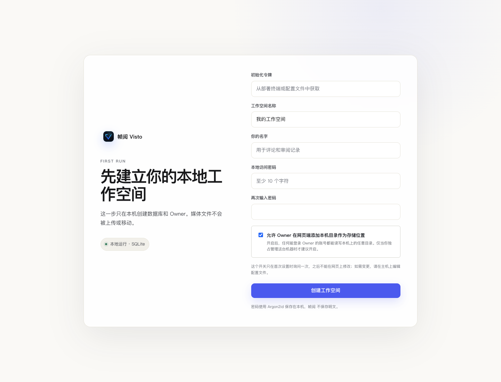

**看图操作：** 先核对初始化令牌，再填写身份信息；最下方的主机目录权限影响后续存储配置，提交前决定好。

### 填写首次设置

| 字段 | 如何填写 | 说明 |
| --- | --- | --- |
| 初始化令牌 | 由部署维护者在主机取得 | 原生 macOS 从配置目录读取；Docker 使用启动时生成的值 |
| 工作空间名称 | 如“视频制作团队” | 会出现在工作台，名称应让成员容易辨认 |
| 你的名字 | 如“项目负责人”或真实姓名 | 用于评论和审阅记录，不是共享身份 |
| 本地访问密码 | 至少 10 个字符的强密码 | 不与其他网站复用 |
| 再次输入密码 | 与上面完全一致 | 输入不一致时不能提交 |

macOS 读取初始化令牌：

```bash
sudo cat /Library/Visto/config/host-management-token
```

令牌用于首次领取初始化权限，和日常登录密码不同。不要把该输出贴到聊天、截图或公开 Issue。

### 一次性的主机目录权限

“允许 Owner 在网页端添加本机目录作为存储位置”默认开启。开启后，Owner 网页会话能配置主机目录，适合由你独占管理的机器；不信任所有 Owner 登录环境或部署在共享主机时，应由维护者评估后选择关闭。

该选项**首次设置后不能在网页上更改**。需要调整时由主机维护者编辑 `visto.env` 的 `VISTO_ALLOW_WEB_HOST_PATHS`：`0` 关闭，`1` 强制开启，然后重启服务。当前生效状态可在 **Owner 设置 → 网络与安全** 查看。

关闭后普通网页不能添加本机路径。项目成员仍可使用已经授权给项目的存储；如果必须添加新的主机目录，请联系部署维护者，不要求成员知道服务器真实路径，也不把 Desktop 当作免费版前置条件。

### 日常登录

初始化完成后，日常使用成员邮箱和密码进入。旧工作空间 / 首次 Owner 可能尚未设置登录邮箱，登录页提示允许邮箱留空时可使用原访问密码。登录后在“我的账户”确认个人身份与可用资料；新增成员使用独立邀请或注册流程。

### 完成检查与问题处理

- 成功后进入项目列表，而不是仍停留在创建表单。
- 密码错误、令牌错误和创建失败会显示提示，先按提示修正，不重复初始化。
- 已有实例突然出现首次设置页时，先核对浏览器地址和数据目录是否指向原实例。不要立即创建一个新工作空间覆盖问题。
- 忘记 Owner 密码时联系主机维护者，通过当前版本支持的账号恢复方式处理，不删除数据库重新初始化。

<!-- chapter: storage | 项目与素材 -->
## 11 · 配置文件保存位置

**谁来操作：** Owner。**入口：** Owner 设置 → 存储与上传安全。

Visto 需要先有可用且已开放的存储，项目才能选择上传落点。浏览器所在电脑的路径不等于服务器路径：主机目录始终指向运行 Visto 的电脑或容器可见目录。

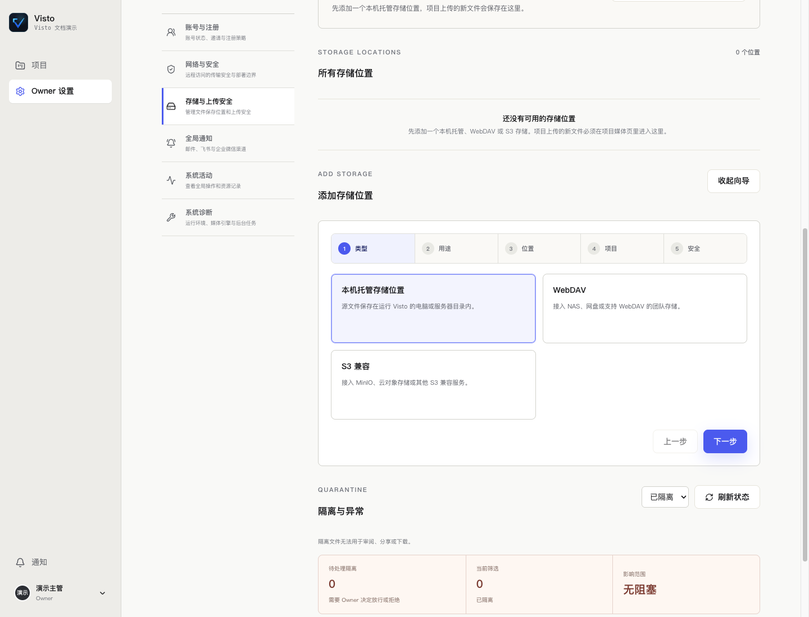

**看图操作：** 上方查看现有保存位置和异常，下面的向导按“类型 → 用途 → 位置 → 项目 → 安全”依次完成。

### 三种存储选择

| 类型 | 要准备的信息 | 常见场景 |
| --- | --- | --- |
| 本机托管存储 | 主机上的专用绝对目录、可写权限、空间 | 单机制作、连接在部署主机上的磁盘 |
| WebDAV | 服务地址、用户名、密码、允许的目录 | 支持 WebDAV 的 NAS 或存储服务 |
| S3 兼容 | Endpoint、Bucket、Region 及访问密钥等页面字段 | MinIO 或对象存储 |

使用最小必要权限的账号。远程连接先按页面测试连通性；网络策略可能拒绝某些地址，不能把地址填成可访问任意主机的代理。

### 本机存储：路径、权限和配额

名称用于让项目成员辨认，如“制作素材盘”；主机目录使用运行 Visto 的机器上的绝对路径。建议由维护者先建一个专用目录，给服务运行账号所需权限，再在向导填写；不要为了修复写入错误让所有人拥有整块磁盘的任意权限。

外接盘使用前确认它已挂载，盘名和路径稳定。Docker 中填写的是容器可见路径，宿主机目录需要由维护者正确挂载。容量配额留空时按页面含义不限制，并不意味着磁盘无限大。关注存储剩余空间，预览与备份也需要容量。

### WebDAV：每个字段怎么填

| 字段 | 示例（虚构） | 填写要点 |
| --- | --- | --- |
| 连接名称 | 团队 NAS · 制作资料 | 让项目主管能识别，不写密码 |
| 连接地址 | `https://nas.example.com/dav` | 使用服务提供的 WebDAV Endpoint，不填普通登录页 |
| 用户名 / 密码 | 独立的媒体服务账号 | 需有目标目录的读取及所需写入权限 |
| 默认路径前缀 | `team-media` 或留空 | 限定这条连接使用的范围，和服务器路径结构一致 |
| 允许连接局域网或内网地址 | 仅在需要接入可信 NAS 时启用 | 只授权你明确知道的内部存储服务 |

创建连接后按界面测试。连接通了但项目上传仍不可用时，继续检查根目录范围、项目开放和用途。修改既有凭据时读清页面“留空保留”说明，不误把密码清空。

### S3 兼容：Endpoint、Bucket 与前缀

| 字段 | 示例（虚构） | 填写要点 |
| --- | --- | --- |
| 连接地址 | `https://s3.example.com` | 使用存储商提供的 API Endpoint，不用控制台网页地址 |
| Access Key / Secret Key | 专用访问密钥 | 不截图、不写入项目说明，不用个人最高权限密钥 |
| 区域 | 存储商要求的 Region | 以服务实际配置为准，不复制其他供应商的值 |
| 桶名称 | `team-media` | 必须是已存在且该密钥有权访问的 Bucket |
| 默认路径前缀 | `visto/brand-film` | 限定对象范围，和实际组织约定一致 |

Endpoint、区域、桶与密钥要属于同一服务。测试失败时区分连通性、认证和对象权限，不连续换填猜测值。上述域名和桶名只用于解释字段，不能直接用作可连接的存储。

### 完成五步向导

1. **类型：** 选择本机、WebDAV 或 S3。
2. **用途：** 日常上传选“作为项目上传位置”；交付保存选“作为归档位置”；评论附件选对应用途。归档位置不会自动成为默认上传位置。
3. **位置：** 填可辨认的名称和相应连接信息。主机目录权限关闭时，本机路径不能在普通网页添加。
4. **项目：** 选择开放范围。保存一个连接不代表所有项目都获得使用权限。
5. **安全：** 选择上传安全策略并提交，查看成功或错误提示。

### 上传安全策略

| 策略 | 适合的使用情景 | 需要理解的边界 |
| --- | --- | --- |
| 快速 | 可信素材和受控内部协作 | 保留路径、权限、大小等基础检查；恶意软件扫描可能记为未扫描 |
| 标准 | 日常默认项目上传 | 基础检查和媒体探测后处理；扫描结果继续影响分享与下载 |
| 增强 | 公网、访客或不可信来源素材 | 检查通过前不应进入可分享、可下载、可审阅状态；还要配置实际扫描能力 |

策略名称不代表扫描引擎已经配置。查看具体检查结果，“未扫描”不能当作“安全扫描通过”。

### 让项目真正能用

创建后检查存储显示“可用”，用途是上传，开放范围包括当前项目。进入 **项目设置 → 项目存储** 确认上传位置。若下拉框为空，依次检查：是否有活动存储、是否允许上传、是否对项目开放、是否因配额或错误停用。

### 修改、停用和删除

修改存储前先查看受影响项目。停用可能阻止后续上传；删除连接和删除原文件不是一回事，按影响说明处理。不要从操作系统直接挪走正在使用的目录；已有媒体引用可能失效。新增归档位置也不会自动把全部媒体复制过去。

**完成检查：** 项目能选到位置，上传小文件成功，预览可读，空间与权限符合预期。

<!-- chapter: project | 项目与素材 -->
## 12 · 创建与管理项目

项目是协作范围。把不同客户、交付批次或权限边界放进不同项目，可以减少误共享和误操作。

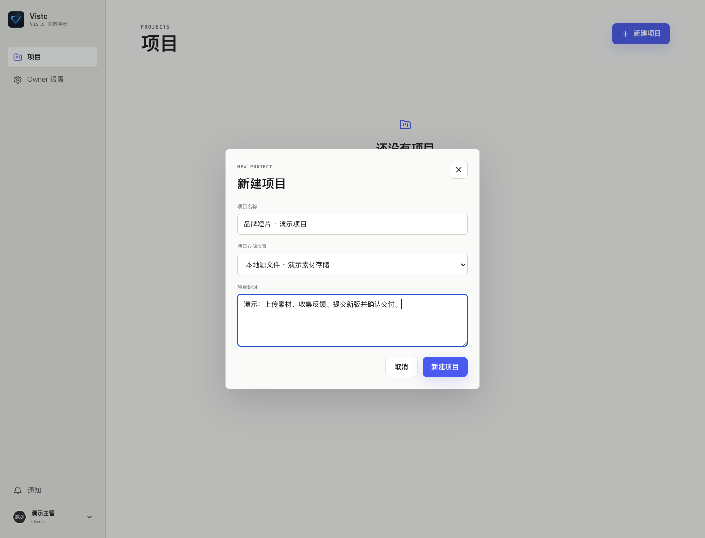

### 创建项目

1. 回到项目列表，点“新建项目”。
2. 填写名称；建议“作品 / 客户 + 批次”，避免多个“新项目”。
3. 选择已开放的“项目存储位置”。没有位置可选时让 Owner 配置，不去寻找扫描导入入口。
4. 在说明里写目标、交付内容、负责人员和时间。
5. 提交并确认进入正确项目。

示例说明：“60 秒品牌短片；主片横版 16:9，社交裁切另立资产；导演先看节奏，客户确认文案；交付日前完成最终审阅。”

### 项目主管的日常维护

在项目设置维护基本资料和成员；存储只选择 Owner 已授权的范围。更换上传位置主要决定后续落点，不应默认理解为已有媒体已迁移。需要转移主管职责时使用项目提供的转移流程，检查新的主管和自己的保留角色，再确认。

### 成员看不到项目时

先检查是否登录正确工作空间和账号，再检查项目成员关系、账号状态和期限。用户已经注册或已经在团队里，不代表已被加入该项目。失去成员资格、项目删除或权限不足都可能使项目不可见。

**完成检查：** 名称和说明正确、上传存储可用、成员在各自账号中可见应参与的项目。

<!-- chapter: members | 项目与素材 -->
## 13 · 成员、邀请与权限

Visto 有工作空间账号与项目成员两层关系。团队邀请让一个人拥有自己的账号；项目成员关系决定他能在哪个项目里工作。

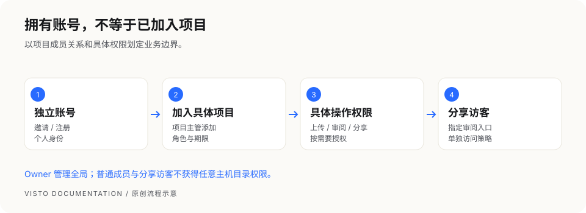

### 常见身份

| 身份 | 作用 | 权限原则 |
| --- | --- | --- |
| Owner | 管理全局基础设施和账号 | 有广泛权限，只交给可信维护者 |
| 项目主管 | 管理被分配项目的成员和协作 | 不等于获得其他项目或主机权限 |
| 项目成员 | 参与被加入项目的素材与审阅 | 具体上传、移除、分享和结论权限看成员设置 |
| 临时账户 | 有限项目访问或临时协作 | 检查权限和到期时间；默认权限可较少 |
| 分享访客 | 从指定分享入口查看内容 | 由分享范围、密码、有效期、评论及下载开关约束 |

项目成员默认可有较多协作权限，包括上传、审阅、分享或从项目移除媒体；若某人只需观看，应明确收紧权限，不凭角色名称推断“只读”。

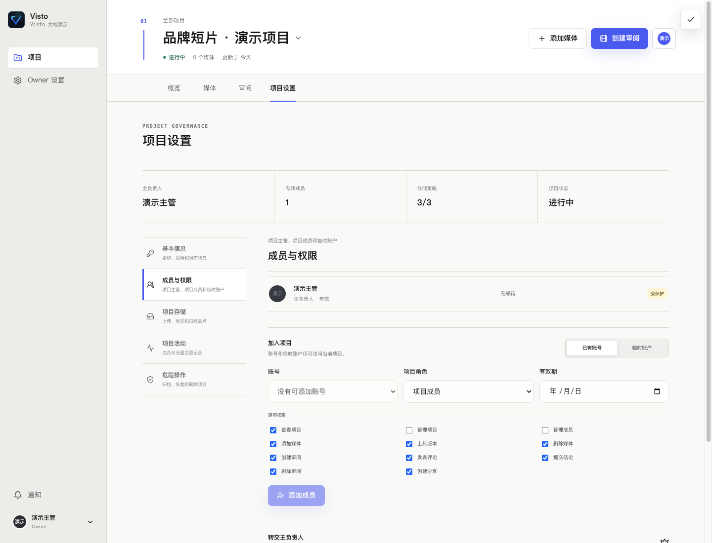

**看图操作：** 在项目设置里管理成员；工作空间账号与本项目的角色分别确认。

### 邀请并加入项目

1. Owner 在 **Owner 设置 → 账号与注册** 创建成员邀请，填写成员邮箱并选择合适的账户类型。
2. 将本次邀请入口交给对应成员；邀请链接和账号不要多人共用。
3. 成员打开邀请页，按页面完成自己的资料和密码设置。
4. Owner 或具备权限的项目主管进入 **项目设置 → 成员与权限**，将该账号加入项目。
5. 选择项目角色及具体权限；有时间边界时设有效期。
6. 用成员自己的账号确认能看见项目、能做被允许的操作。

### 开放注册

Owner 可以配置注册策略。允许注册并不自动给新用户任何项目权限；项目主管或 Owner 仍需把用户加入具体项目。

### 调整或收回访问

成员离开项目时，检查项目成员关系、临时账户期限、已创建的分享和后续通知。移除成员不能收回已被对方下载的文件；外部分享也需要单独检查和撤销。

<!-- chapter: upload | 项目与素材 -->
## 14 · 上传、搜索与整理素材

**谁来操作：** 有相应项目上传权限的成员。**入口：** 进入具体项目 → 媒体。

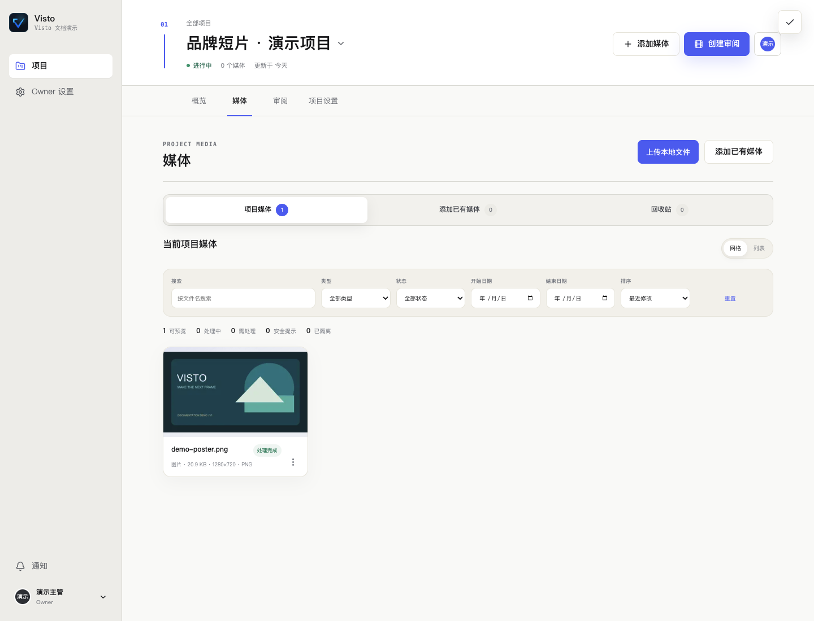

### 上传一个或多个文件

1. 确认顶部项目名。
2. 选择“上传本地文件”，从自己电脑选图片或视频。
3. 在上传任务面板查看等待、传输进度、完成或失败。
4. 失败时先看原因，按需要重新上传；未完成前不要关闭浏览器。
5. 传输完成后等待后台媒体识别与预览处理，再打开素材验证。

浏览器上传把选中的文件复制到项目授权的存储。已存在于服务器的文件不会仅因打开页面而被扫描导入；日常上传应始终在项目内完成。

### 分清三类状态

| 状态层 | 表示什么 | 你应该做什么 |
| --- | --- | --- |
| 上传进度 | 文件是否传完 | 等待完成或修复传输问题 |
| 上传安全检查 | 文件是否可继续参与协作 | 处理隔离、拒绝或扫描提示 |
| 媒体处理 | 预览、识别及增强任务是否完成 | 等处理结束，失败时查看任务详情 |

“上传完成”与“可预览”是不同阶段。源文件在库中但预览失败时，不要先删除重传，先检查运行时和具体任务。

### 搜索和筛选

按文件名搜索，再用类型、处理状态、开始 / 结束日期和排序缩小范围。找不到刚上传文件时，先点“重置”，确认当前项目、页码和筛选条件，再检查上传结果。

网格适合看画面，列表适合看文件信息。打开素材详情可以重命名、查看预览、元信息和版本历史。

### 加入已有媒体、复制和剪切

“添加已有媒体”只展示你有权使用的已有媒体，不是任意主机扫描入口。将资产加入另一个项目前，检查目标项目权限和存储要求。

详情中的“复制 / 剪切”是跨项目操作；不要把它等同于已经在另一个物理磁盘复制了完整文件。按页面结果检查目标项目可见性和媒体可读性。“从当前项目移除”进入项目回收站，恢复步骤见“归档与删除”。

### 命名约定建议

同一作品使用一个资产名称，如“品牌短片主片”；版本保留 V1、V2 的编号。横版、竖版或语言版本若分别交付，可以用不同资产，避免仅靠“最终版 / 最终版2 / 真最终版”区分。

<!-- chapter: archive | 项目与素材 -->
## 15 · 回收站、归档与删除

这些操作的影响不同。执行前先确认你要解决的是“从当前项目移除素材”“停止协作”还是“彻底删除项目”。

| 操作 | 作用 | 能否代替备份 |
| --- | --- | --- |
| 从当前项目移除媒体 | 从当前项目关系中移除，可在项目回收站恢复 | 不能 |
| 恢复回收站媒体 | 把被移除的媒体重新加入当前项目 | 不能 |
| 归档项目 | 保留项目数据，暂停项目内写入和存储调整 | 不能 |
| 恢复项目 | 把已归档项目恢复为进行中 | 不能 |
| 删除项目 | 按确认说明处理项目，可能不可恢复 | 必须先有独立备份 |

### 恢复误移除媒体

进入项目“媒体 → 回收站”，找到相应媒体，使用恢复操作并查看提示。回到项目媒体确认文件和版本可读。若底层原文件已经被外部删除，恢复项目关系不会凭空恢复文件。

### 项目交付后的归档

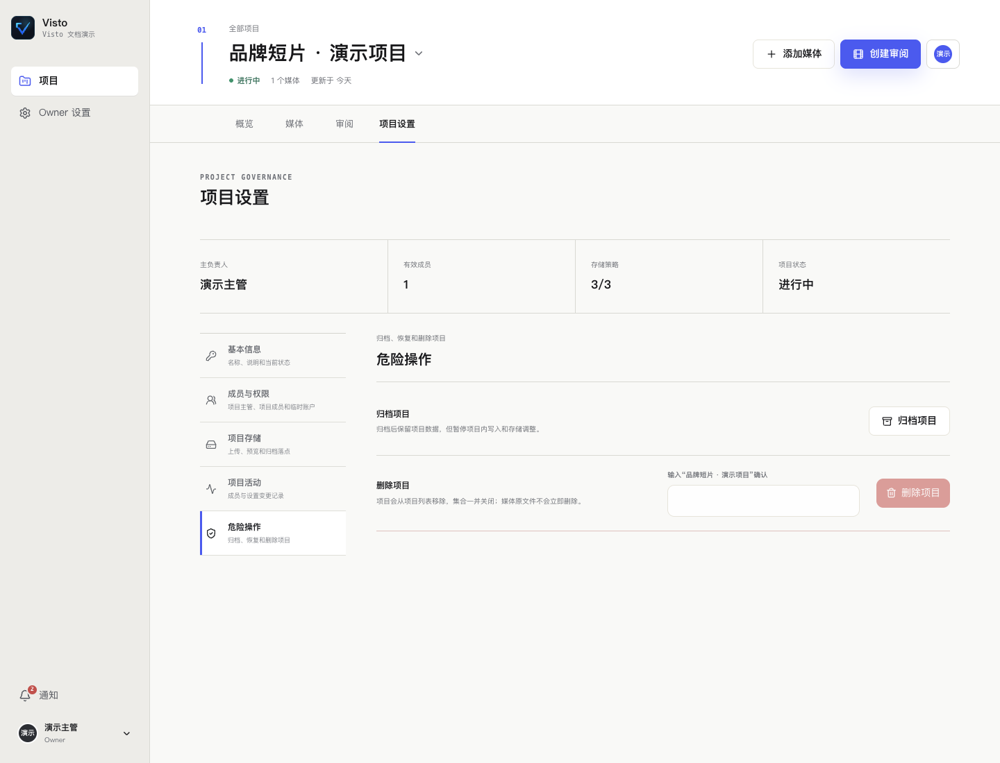

1. 确认最终版本、正式结论和交付内容。
2. 检查未解决反馈，记录保留原因。
3. 检查外部分享，需要停止访问的先撤销。
4. 确认实际备份和必要的媒体异盘副本。
5. 进入 **项目设置 → 危险操作**，选择归档并确认。

归档不会自动把素材复制到归档存储，不会自动做异地备份，也不应假定已经撤销所有分享。需要再次修改时先恢复项目，再重新审阅新版本。

### 删除前必须确认的内容

读清页面对删除范围和可恢复性的提示，核对项目名、版本、分享及备份。不能用项目回收站替代整库恢复。备份恢复通常会影响整个实例，不只是一个项目，请让维护者评估后处理。

<!-- chapter: versions | 审阅与交付 -->
## 16 · 版本管理与新一轮修订

版本历史让你保留原始审阅上下文。修订同一作品时，从原资产的“上传新版本”进入，而不是把修订文件上传成另一个没有关联的资产。

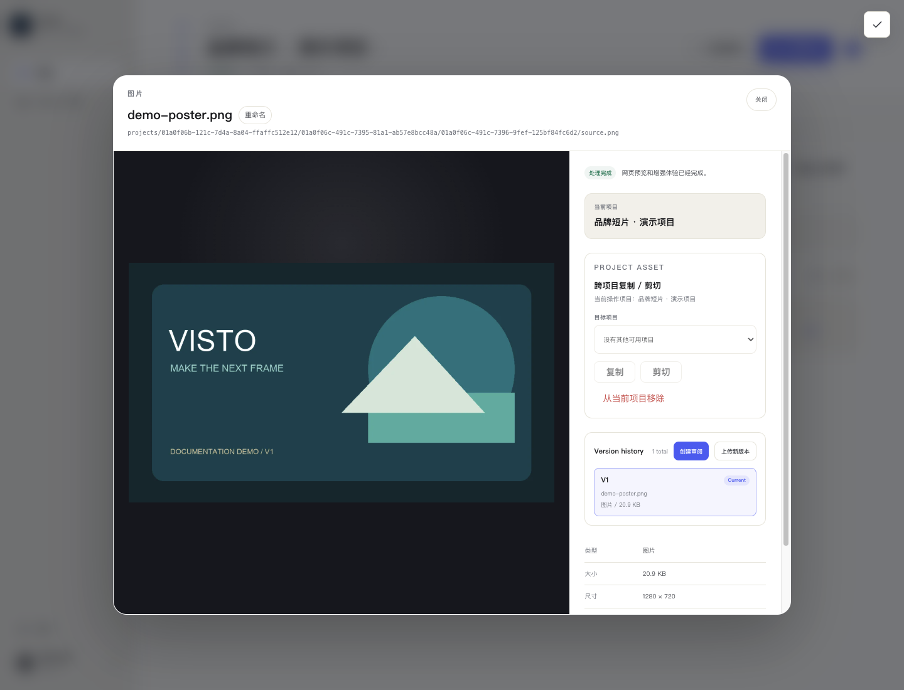

### 上传新版

1. 进入项目媒体，打开原资产详情。
2. 在 `Version history` 区域选择“上传新版本”。
3. 选修订文件，等待上传和处理完成。
4. 确认历史出现 V2 / 下一版本，检查画面和文件信息。
5. 核对 `Current` 标记；需要调整时使用页面支持的当前版本切换操作。
6. 明确选择新版本，再点“创建审阅”开始下一轮。

选择某一历史版本用于预览，与把它设为资产当前版本是两种操作。仅点开 V1 看画面，不应默认认为当前版本已切换到 V1。

### 旧评论会怎样

旧审阅与其评论仍属于原先引用的版本。把 V2 上传到资产并不自动把 V1 的审阅换成 V2。客户从旧链接看到旧版时，先检查分享对应的审阅清单；为新版建立新审阅并发送正确链接。

### 修订说明怎么写

可以在审阅名称和评论中注明改动范围：“V2：调整 00:12–00:18 节奏，修改片尾文案，其他镜头保持。”接收者容易确认改动，你也能追踪哪条反馈已落实。

**完成检查：** 版本编号正确、预览正确、当前版本明确、下一轮审阅确实引用新版。

<!-- chapter: reviews | 审阅与交付 -->
## 17 · 创建一轮审阅

**谁来操作：** 有创建审阅权限的项目成员。审阅是一轮明确的确认任务，围绕指定版本组织参与者、截止时间和判断规则。

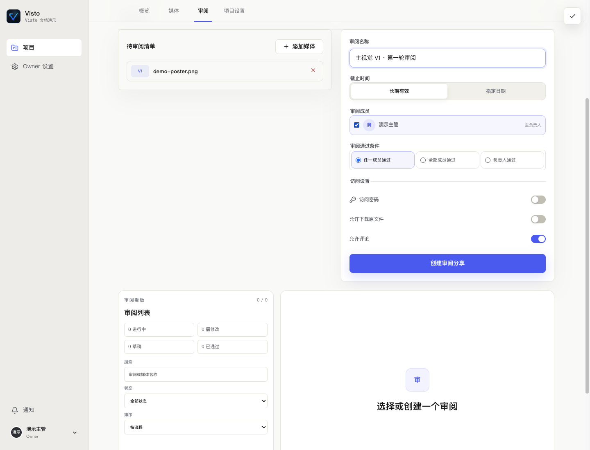

### 创建步骤

1. 从素材详情选定版本后点“创建审阅”；也可在项目“审阅”里选择媒体加入清单。
2. 核对每份作品和 V 编号，移除无关内容。
3. 输入审阅名称，例如“主片 V2 · 客户文案确认”。
4. 设置截止时间；长期有效不代表永远开放写入，仍受审阅状态与分享策略影响。
5. 选择审阅成员和需要的负责人。
6. 选择通过条件。
7. 需要外部分享时设置访问密码、下载和评论权限，提交后核对创建反馈。

### 选择通过条件

| 条件 | 适用情景 | 需要确认 |
| --- | --- | --- |
| 任一审阅者 | 任何一个指定审阅者即可完成确认 | 不适合要求所有部门签字的流程 |
| 所有审阅者 | 每个被要求的审阅者都要确认 | 确保参与者正确，否则可能一直等待 |
| 仅负责人 | 明确由一个负责人做最终判断 | 必须选定负责人，其他评论不替代其结论 |

### 草稿与开启

没有分享权限时，创建结果可能保存为草稿。草稿不等于已经对外发送；先检查审阅状态，按页面开启后再创建分享。创建成功但复制链接失败时，审阅可能已经存在，在详情里继续创建或复制分享，不重新发起相同审阅。

### 看板与详情

项目审阅看板展示不同状态的审阅。打开详情查看固定版本、参与者、评论线程和审核结论。记录每轮的目标，避免把素材级反馈、审阅状态和项目归档混在一起。

**完成检查：** 清单版本正确、参与人正确、判断规则符合要求、所需分享成功创建且复制。

<!-- chapter: comments | 审阅与交付 -->
## 18 · 提交精确反馈与审核结论

好的反馈应说明“哪里、问题是什么、期望如何改”。尽量把内容定位到具体版本、时间或画面区域。

### 视频时间评论

1. 打开对应审阅或分享中的视频，播放到需要反馈的位置并暂停。
2. 选择时间点评论，点“抓取当前时间”，再输入意见。
3. 若问题涉及一段内容，选择时间区间，设置起点和终点。
4. 提交后确认评论出现，重新点击评论检查时间定位。

示例：“00:12.400–00:15.000：字幕先于旁白出现。请把字幕入点后移到第一句话开始。”

### 图片点位、区域与画面标记

在图片评论区选择对应工具：点位用于一个具体位置，区域用于一块画面，箭头、笔刷或矩形用于表达视觉关系。先在画面上标记，再写说明。提交后点击评论检查标记位置是否正确。

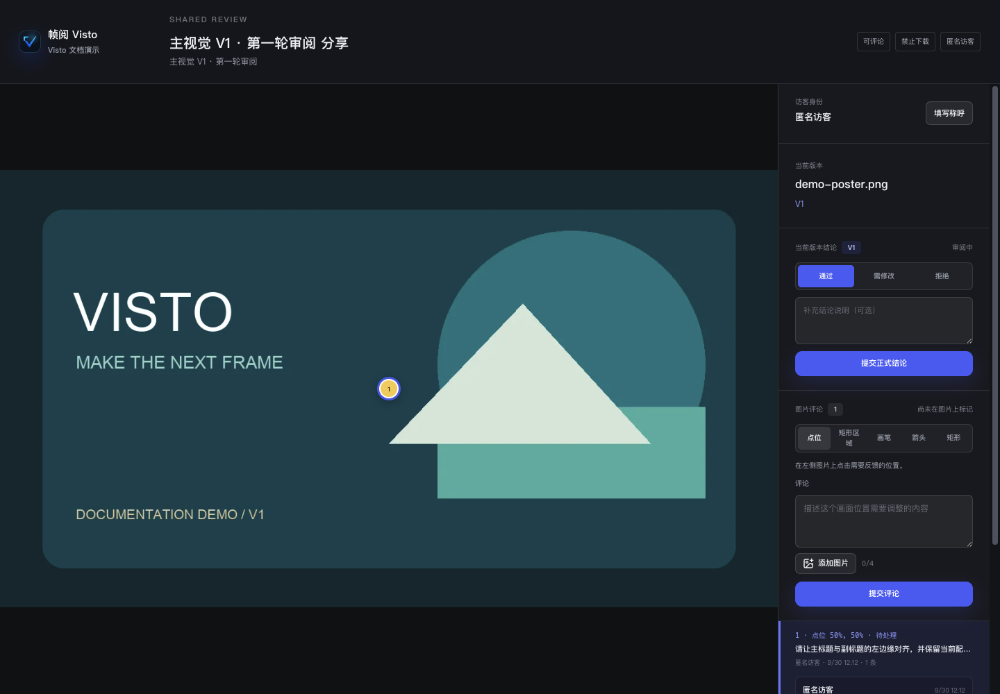

### 附件与回复

页面开放评论附件时，可附参考图片或文件。附件上传也可能经过安全检查；没有可用附件存储或策略拒绝时，先联系 Owner。涉及客户信息的参考文件只传到正确项目或分享。

回复里写清处理方案。具备权限的处理者可以把线程标为已解决；“已解决”表示反馈处理状态，不自动等于整轮审阅通过。

### 审核结论

具备结论权限的审阅者在审核结论区域提交：

| 结论 | 表达的意思 | 建议备注 |
| --- | --- | --- |
| 通过 | 当前审阅版本符合本轮要求 | 明确是否可以交付 |
| 需修改 | 需要进一步修订 | 指向未解决反馈或说明修改范围 |
| 拒绝 | 当前版本未达到要求 | 解释原因和下一步 |

按本轮通过条件汇总结论。分享开放评论且审阅未处于草稿或结束状态时，访客也可以对当前固定版本提交正式结论；匿名访客以分享会话记录身份。关闭分享评论权限时，访客的新评论与正式结论都不能提交。

<!-- chapter: sharing | 审阅与交付 -->
## 19 · 创建、安全检查与撤销分享

分享让外部人员访问指定审阅内容，不必给他们 Owner 账号或整个工作空间权限。

### 分享之前先检查四件事

1. **内容范围：** 只包含要让接收者看的媒体与版本。
2. **访问方式：** 按需要设置访问密码、到期时间及昵称要求。
3. **允许操作：** 评论与下载分别控制；能播放不代表允许下载原片。
4. **可达地址：** 接收者必须能访问该主机 / 团队域名；`127.0.0.1` 只能给本机用。

### 创建并验证

在创建审阅时设置访问策略，或在审阅详情的“分享与通知”创建分享。确认成功后复制链接，需要密码时将密码与链接妥善交付。

用另一个未登录的浏览器窗口验证：是否要求密码、显示的文件和版本是否正确、评论和下载是否如预期。再在接收者实际使用的网络设备上验证可达性；本机验证通过不能证明外网已能访问。

### 更新或撤销

在审阅详情的分享记录中查看现有分享、展开链接与密码，按页面支持调整策略、撤销或重新生成入口。撤销后再次从未登录窗口测试失效结果。

重新生成链接会影响原接收者，记得发送新链接。撤销只能阻止后续访问，无法收回已经下载或复制的内容。

### 为什么客户仍然看到旧版

分享引用的是对应审阅，而审阅固定了媒体版本。上传 V2 后，用 V2 创建新一轮并发送新入口。不要把“当前版本已更新”当成“所有旧链接都自动更新”。

**完成检查：** 未登录可按策略访问、链接实际可达、范围正确、密码和下载规则正确。

<!-- chapter: guest | 审阅与交付 -->
## 20 · 给外部审阅者的操作指南

本章可以直接交给客户或合作方。你通常只需要分享链接和发布方提供的访问码；无需安装 Visto，也不要索要团队 Owner 密码。

### 打开链接

1. 用浏览器打开收到的链接。
2. 页面要求密码时，输入发布方提供的访问码。
3. 要求昵称时，填写能让团队辨认的姓名或公司与姓名。
4. 检查显示的作品名称和版本，选择相应作品查看。

### 看画面、写反馈

图片可以用点位或区域评论标出问题；视频可以暂停后抓取当前时间，也可选择时间区间。建议格式：“位置 + 问题 + 希望的修改”。提交后确认评论出现在列表。

如页面只开放观看，评论按钮不会可用。下载同样由发布方决定，不能下载时先询问发布方是否需要交付源文件。

### 提交当前版本的正式结论

分享开放评论且审阅未结束时，可以在“当前版本结论”选择“通过”“需修改”或“拒绝”，填写说明后提交。确认页面显示已记录的结果。该操作针对当前固定版本；文字评论与正式结论是两种记录。分享关闭访客反馈或审阅结束后不能继续提交。

### 访问失败时

| 提示 / 现象 | 可以做什么 |
| --- | --- |
| 访问码错误 | 核对空格、大小写及是否收到新的密码 |
| 链接过期或撤销 | 请发布方确认分享记录并重新提供入口 |
| 页面打不开 | 确认是否需要加入团队网络 / VPN，是否是误发的本机地址 |
| 视频能打开但不能播放 | 告知发布方作品名、版本、浏览器和错误截图 |
| 没有评论或下载按钮 | 请发布方检查分享策略 |
| 看到旧版 | 发回所见版本号，请发布方确认新一轮分享 |

反馈问题时不要把访问密码、完整含令牌链接或客户原片发到公开社区。

<!-- chapter: notifications | 设置与维护 -->
## 21 · 通知、个人资料与活动

通知帮助成员及时看到审阅和协作变化。外部通知是否可用取决于 Owner 配置的渠道和成员自己的接收偏好。

### 我的账户

点击右上角个人入口，进入“我的账户”。查看身份、维护显示名称、界面语言和接收偏好，保存后确认成功提示。个人姓名会用于评论和成员列表；界面语言会影响导航与部分页面文案。

### 站内通知

从全局“通知”进入，查看自己有权访问的消息。点消息回到相关项目或审阅，阅读后按页面操作标记状态。没有消息时，先检查是否是正确账号和对应事件是否已发生。

### 外部渠道

Owner 在 **Owner 设置 → 全局通知** 配置邮件、飞书或企业微信等已有渠道，填写服务信息后测试。渠道密码、Webhook 和密钥只由 Owner 管理，不发送给普通成员。

“渠道测试成功”说明测试投递成功，不能单独证明每位成员都收得到：还要核对成员接收地址、个人偏好和真实事件投递状态。

### 活动与审计

项目设置中的活动记录帮助追踪谁在什么时候做过什么；Owner 系统活动用于全局排查。按时间、成员、动作和资源筛选，遇到失败投递时保留状态和错误信息再处理。活动记录不能代替媒体备份。

<!-- chapter: network | 设置与维护 -->
## 22 · 网络与远程访问

默认原生 Server 只监听本机；默认 Compose Web 也绑定本机。把分享链接交给异地客户以前，先由部署维护者配置可达地址和 HTTPS 入口。

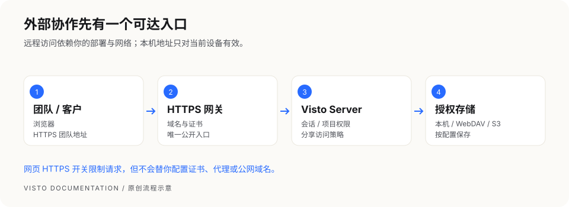

### 四个容易混淆的设置

| 设置 | 决定什么 | 不会替你完成什么 |
| --- | --- | --- |
| 服务监听 / 网关入口 | 哪些设备可以连接 | 不自动生成公网域名 |
| HTTPS 网关 | 对外链路加密和入口路由 | 不自动授予项目权限 |
| 远程访问必须使用 HTTPS | 拒绝非本机明文 API 请求 | 不负责安装证书或配置代理 |
| 网页端添加本机目录权限 | Owner 网页能否添加主机存储 | 不授予普通成员任意目录访问 |

### 正确的开启顺序

1. 维护者配置 HTTPS 域名、证书及反向代理，确保 Visto 正常工作。
2. 用远程设备访问 HTTPS 地址并验证登录和分享。
3. 在 **Owner 设置 → 网络与安全** 打开“远程访问必须使用 HTTPS”。
4. 保存后立即生效，再检查团队和分享入口。
5. 防火墙和代理应使 HTTPS 网关成为唯一公开入口。

该开关默认关闭。开启后，非回环明文 API 请求可能返回 `426 security.https_required`。本机 `127.0.0.1` 仍可使用 HTTP。正在通过远程 HTTP 操作时，系统会阻止会导致自锁的开启请求；请先切换到 HTTPS 或到部署主机操作。

### 由部署配置强制

`REVIEW_STUDIO_REQUIRE_HTTPS=1` 会强制 HTTPS 策略，网页不能关闭，需要维护者改主机配置并重启。代理信任和 Cookie 的安全标记由部署配置及真实请求协议决定，不能只打开网页开关就认为代理已正确配置。

### 推荐交付给成员的信息

团队的 HTTPS 地址、登录方式、项目邀请、能访问的网络范围及支持联系人。不要把主机配置、初始化令牌或底层存储密钥一并发送。

<!-- chapter: backup | 设置与维护 -->
## 23 · 备份：保护数据库与媒体

本章命令适用于 macOS 原生 Server，由部署维护者在主机执行。备份会短暂影响服务，选择没有上传和重要审阅的时间窗口。

### 先分清备份覆盖范围

| 数据 | 原生数据目录备份是否自动覆盖 | 应如何安排 |
| --- | --- | --- |
| 数据目录内的数据库、加密秘密、系统托管源文件和预览 | 随数据目录归档 | 保留归档与同名元数据 |
| 配在数据目录外的本机 / 外接盘媒体 | 不会因数据库记录存在就自动打包 | 单独复制或快照，并保持引用路径可用 |
| WebDAV / S3 上的实际媒体文件 | 不会自动下载全部对象到原生备份 | 使用对应存储的版本、快照或独立备份 |
| 主机配置、证书、部署说明 | 不应假定都在业务数据归档里 | 由维护者另做安全备份，妥善保护秘密 |

**最常见误区：** 数据库里有文件记录，不代表这份备份已经包含全部原片。先清点每个存储的物理落点，再决定备份范围。

### 创建备份

```bash
sudo /Library/Visto/current/scripts/backup-visto-server.sh
```

脚本会证明服务已经停止，再归档数据，随后按流程启动并检查就绪。停服证明失败时会中止；不要手动伪造成功记录或直接打包正在变化的数据库。

### 确认完成

1. 命令成功退出并打印实际备份路径。
2. 归档和 `<归档文件>.json` 元数据均存在。元数据记录摘要和恢复所需信息。
3. 服务重新就绪，浏览器能读取项目。
4. 把这两个文件一起复制到另一块磁盘或可信备份位置。
5. 把数据目录外媒体和部署配置的独立备份与此次备份关联记录。

### 建议的备份时机

首次完成配置后、重要交付后、每次更新前、每次恢复或大规模存储调整前。按项目价值安排日常周期，并定期在隔离环境检查可恢复性；“文件存在”不等于“恢复已验收”。

<!-- chapter: maintenance | 设置与维护 -->
## 24 · 更新、恢复、回滚与卸载

本章适用于 macOS 原生 Server。执行的是主机维护操作，普通项目成员无需运行。占位符必须替换成实际路径、版本和摘要；保留所有命令输出用于定位失败。

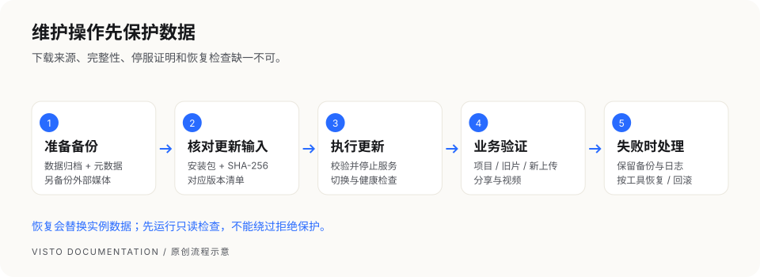

### 更新：安装包、摘要和版本清单要匹配

免费 Server 提示新版本后，由维护者从官方 Release 手动下载。免费版本提示清单不签名，不自动下载或安装；SHA-256 校验是完整性检查，不能替代下载来源的可信度。

当前原生更新脚本还要求**版本清单文件**。不能只提供包与摘要；未传 `--manifest` 时脚本会查找 `<安装包路径>.manifest.json`。按同一 Release 的说明取得版本清单，确认其 `version` 与包一致。若 Release 未提供可用清单或安装路径，停止并联系维护者，不随意拼写清单绕过缺失。

1. 记录当前版本与运行状态。
2. 创建备份，把归档、元数据和外部媒体副本妥善保存。
3. 下载同一发布的包、摘要与版本清单。
4. 校验 SHA-256，执行：

```bash
sudo /Library/Visto/current/scripts/update-visto-server.sh \
  --package '/实际路径/Visto-Server_<版本>_macos-arm64.tar.gz' \
  --sha256 '<官方公布的64位SHA-256>' \
  --manifest '/实际路径/该版本的清单.json'
```

脚本在校验、停服和备份保护后切换程序，检查健康状态；失败时按工具的恢复流程处理。不要手工改 `current` 链接。

### 更新后检查

```bash
curl -fsS http://127.0.0.1:8787/health/ready
sudo /Library/Visto/current/bin/visto-server --json \
  --address 127.0.0.1:8787 status
```

再用浏览器确认项目、旧文件、新上传、视频播放和分享。健康接口通过不能代替业务数据检查。

### 日常服务启停与日志

维护前确认没有在途上传或重要审阅。默认 macOS 实例可以用系统服务管理器停止或启动：

```bash
# 停止
sudo launchctl bootout system/com.visto.server
# 启动
sudo launchctl bootstrap system /Library/LaunchDaemons/com.visto.server.plist
# 已加载服务的重启
sudo launchctl kickstart -k system/com.visto.server
```

启动或重启后再次查 `health/ready` 并在网页验证。若提示服务不存在或已加载，先确认当前服务状态和实际安装配置，不反复执行。默认日志位于 `/Library/Logs/Visto`；保留相关时间段的错误即可，发给他人前脱敏。网页全局设置通常保存后立即生效，主机环境配置的修改则按要求重启。

### 恢复：先只读检查，再执行替换

恢复会替换**当前实例的数据目录**，会影响备份之后的业务变化。先保存当前实例的备份；确认目标主机、数据目录、归档和同名元数据。

```bash
sudo /Library/Visto/current/scripts/restore-visto-server.sh \
  --backup-file '/实际路径/备份.tar.gz' \
  --check-only
```

只读检查通过且你已确认覆盖影响后执行：

```bash
sudo /Library/Visto/current/scripts/restore-visto-server.sh \
  --backup-file '/实际路径/备份.tar.gz' \
  --confirm-restore
```

两种模式不能同时使用。当前恢复保护要求原数据目录一致；跨目录恢复可能被拒绝。拒绝时保留错误，不手工解压覆盖数据库，也不修改元数据去伪装路径。

恢复后确认服务就绪、项目和版本符合备份时间，原文件可读，外部存储仍可访问；数据目录外原片需要独立恢复与核对。

### 回滚到保留的程序版本

```bash
sudo /Library/Visto/current/scripts/rollback-visto-server.sh \
  --to-version '<已保留的版本>' \
  --confirm-rollback
```

程序回滚与数据恢复目的不同；不能假定旧程序一定兼容当前数据库。让工具执行对应保护，按具体失败说明处理。不要删除恢复点、备份或失败日志。

### 卸载

默认卸载保留用户数据和备份：

```bash
sudo /Library/Visto/current/scripts/uninstall-visto-server.sh --yes
```

如果提示 `could not be stopped`，卸载会中止并保留服务配置、程序和数据。先检查服务或进程，解决原因后再试，不手工删除服务配置。

卸载程序不会自动抹掉外接盘或远程存储上的文件。`--purge-data` 会扩大删除影响，只在确认不需要数据并有可用备份时按该版本说明使用。

<!-- chapter: troubleshooting | 帮助与参考 -->
## 25 · 按现象排查问题

先记录“发生了什么、在哪个版本和页面、最近改变了什么”，再做最小检查。失败时不要删除数据或绕过权限、哈希、路径和恢复保护。

### 页面打不开

确认浏览器地址是否是这台主机的地址。原生 macOS 默认本机 8787，Docker 默认本机 8080；实际端口以部署配置为准。

```bash
curl -i http://127.0.0.1:8787/health/ready
```

- 连接被拒绝：检查服务是否运行、端口和 Gatekeeper。
- 返回未就绪：保留响应，查看服务日志与数据库 / 运行时状态。
- 本机能访问而远程失败：检查监听、HTTPS 网关、网络和防火墙。
- `426`：使用正确 HTTPS 入口，核对强制 HTTPS 策略。

### 无法创建项目或上传

| 检查项 | 如何判断 |
| --- | --- |
| 当前账号 / 项目 | 确认处于正确工作空间和项目 |
| 具体权限 | 让项目主管检查上传或管理权限 |
| 存储开放 | Owner 已将活动上传位置开放给这个项目 |
| 空间、配额和写入权限 | Owner 看存储状态，维护者检查磁盘和服务账号 |
| 归档状态 | 已归档项目需要先恢复为进行中 |
| 文件与网络 | 先用小测试文件检查，保留原失败信息 |

### 上传完成但视频没有预览

确认媒体安全检查、后台队列、失败任务和 FFmpeg / ffprobe 状态。部分增强失败可能只影响时间轴缩略图等功能，按页面说明判断，不一概把素材记为完全不可用。

```bash
curl -fsS http://127.0.0.1:8787/health/ready
```

程序检测正常后，再看具体任务错误、文件格式和磁盘空间。文件损坏、来源不可读与运行时未安装需要不同处理。

### 文件被隔离或拒绝

Owner 到 **存储与上传安全 → 隔离与异常** 查看文件、检查结果和原因。“刷新状态”用于重新读取现有结果，不代表强制重做安全扫描。只有确认原因和风险后，才使用页面允许的放行或拒绝操作。普通成员不能绕过隔离去分享或下载。

### 原片曾能打开，现在提示不可读

检查外接盘是否挂载、NAS / S3 是否在线、连接权限是否改变、本机文件是否被移走或删除。不要立即重新导入全部文件。项目回收站恢复的是项目关系，底层媒体丢失仍需从实际媒体备份恢复。

### 分享打不开、过期或没有按钮

先核对当前分享是否被撤销、密码和有效期、审阅状态及链接地址。没有评论或下载按钮，检查对应访问策略；接收者打不开本机地址时，需要正确团队网络入口。

### 保存冲突、登录失效

设置被其他会话修改时，重新载入最新值后再提交，避免覆盖别人的改动。登录失效时重新登录并确认角色；不要用 Owner 账号替代所有成员操作。

### 更新或恢复失败

保留当前数据、安装包、版本清单、摘要、备份、元数据和输出。先解决缺失文件、错误版本或路径不一致。停服证明、哈希或恢复检查不通过时，停止后续写入，联系维护者。

<!-- chapter: faq | 帮助与参考 -->
## 26 · 常见问题

### 我需要安装 Desktop 才能用吗？

本手册的免费 Server 浏览器工作流不以 Desktop 为前置依赖。团队已经部署 Server 时，你只需要地址、账号或分享入口。

### 数据会自动上传到云端吗？

媒体按 Owner 配置的保存位置存储。本机部署和远程存储是不同选择；启用 WebDAV / S3、外部通知或远程分享时，相应数据会经过所配置服务与网络。

### 同一个文件名会自动合并成版本吗？

不要依赖文件名相同自动合并。需要修订原作品时，打开原资产并使用“上传新版本”，再核对版本历史。

### 上传新版后，旧分享会显示新版吗？

不要这样假定。审阅引用固定版本；用新版创建下一轮审阅并发送正确入口，旧审阅继续保留旧版本的上下文。

### 注册后为什么看不到项目？

账号存在不代表已加入项目。请 Owner 或项目主管添加项目成员关系并核对状态、期限和权限。

### 为什么网页不能再改本机目录权限？

这个开关只在首次设置时询问一次。后续由主机配置修改并重启，避免 Owner 网页会话自行改变主机访问边界。

### 归档后文件已经复制到归档盘了吗？

没有这个保证。项目归档是生命周期操作，物理存储复制和备份是独立操作，必须分别确认完成结果。

### 拷贝数据库就算备份全部媒体吗？

不算。需要一致性数据库和加密秘密，也要清点系统托管媒体、外部目录及远程文件。参见“备份”。

### 安全扫描没有结果，是不是安全？

“未扫描”“等待”或“引擎不可用”不能等同安全通过。结合策略、实际引擎和检查结果处理。

### 网页显示有更新会自动安装吗？

免费 Server 只提示版本，主机维护者手动从官方发布页下载校验并更新。媒体运行时的签名安装流程另行处理。

### 能把本机分享地址发给客户吗？

`127.0.0.1` 只对当前设备有效。客户需要一个可达的团队地址和符合策略的 HTTPS 入口。

### 手机上能打开代表移动端已验收吗？

不代表。本手册网页做响应式阅读适配，产品在不同手机、浏览器和文件格式上的兼容性仍以对应版本验收为准。

<!-- chapter: checklist | 帮助与参考 -->
## 27 · 交付检查单与求助模板

### 项目主管：每轮审阅前

- 选定的资产、版本和审阅目标一致。
- 参与者、负责人和通过条件符合本轮要求。
- 截止时间与访问有效期符合安排。
- 分享密码、评论、下载范围已核对。
- 从未登录窗口和接收者网络验证入口。

### 项目成员：提交新版本后

- 上传成功且处理状态可用。
- 新版出现在原资产历史中，当前版本正确。
- 修订说明包含处理的反馈范围。
- 下一轮审阅引用新版，不误发旧链接。

### 维护者：部署或更新后

- 服务就绪，媒体运行时可用。
- 使用正确账号读回既有项目与旧文件。
- 小文件上传、图片预览、视频播放和外部分享可用。
- 备份归档、元数据、外部媒体与主机配置备份齐全。
- 重启后的数据与服务仍可读，或明确记录未测。

### 报告问题时提供什么

复制下面模板给团队维护者；公开问题只发脱敏内容。安全问题通过项目的安全报告入口私下提交。

```text
问题标题：
Visto 版本 / 部署方式：
系统 / 浏览器版本：
发生时间与时区：
我的身份（Owner / 项目主管 / 成员 / 分享访客）：
所在页面与操作：
复现步骤：
1.
2.
3.
预期结果：
实际结果与错误提示：
影响范围（单文件 / 单项目 / 所有用户）：
最近是否更新、改存储或改网络：
已经做过的检查：
脱敏截图或日志片段：
```

不要公开发送原数据库、客户原片、存储密码、初始化令牌、私钥或完整带访问令牌的分享链接。截图也要检查浏览器地址、账号、主机路径和客户信息。

### 手册版本与验证边界

本版对照当前主线源代码、安装说明及维护脚本编写，真实截图来自独立演示数据。界面截图覆盖首次设置、存储向导、创建项目、媒体、版本、审阅、外部图片评论、成员设置及归档说明；流程图为解释操作关系的原创示意。

本文不把写好安装命令等同于在所有平台实际安装通过，不把网页验收等同于产品首发验收。正式发布前仍需使用最终包、最终地址和目标系统执行完整路径复核，并补对应版本说明。
